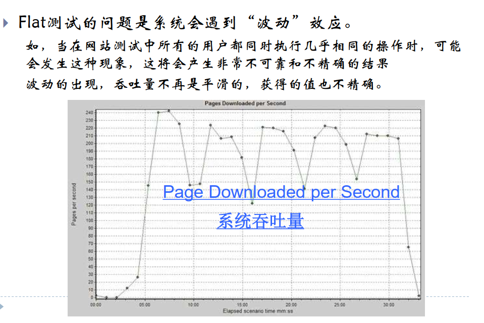
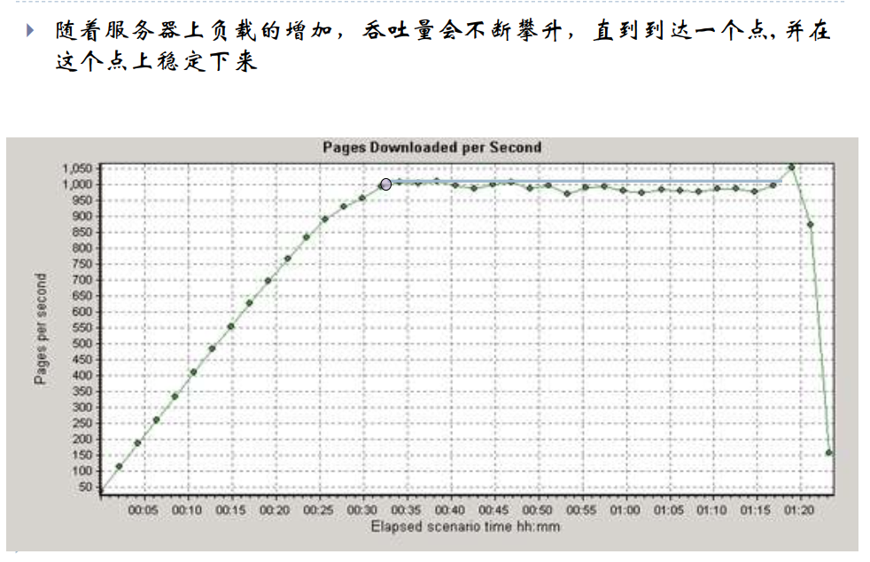
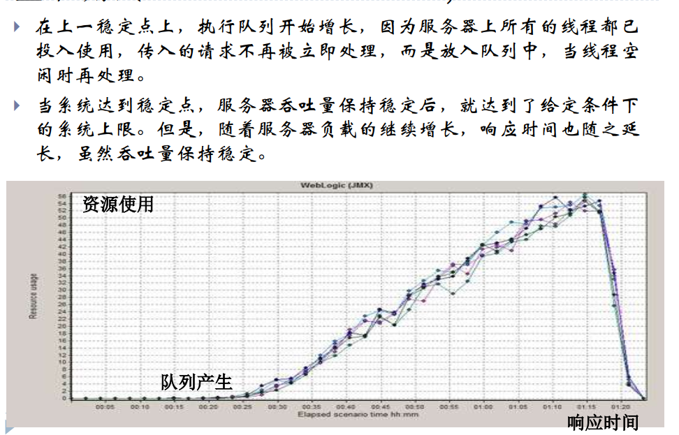
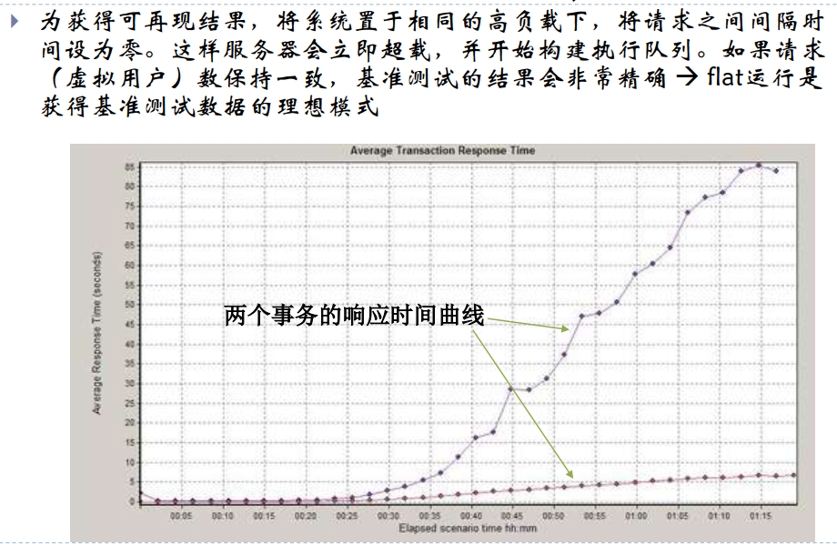
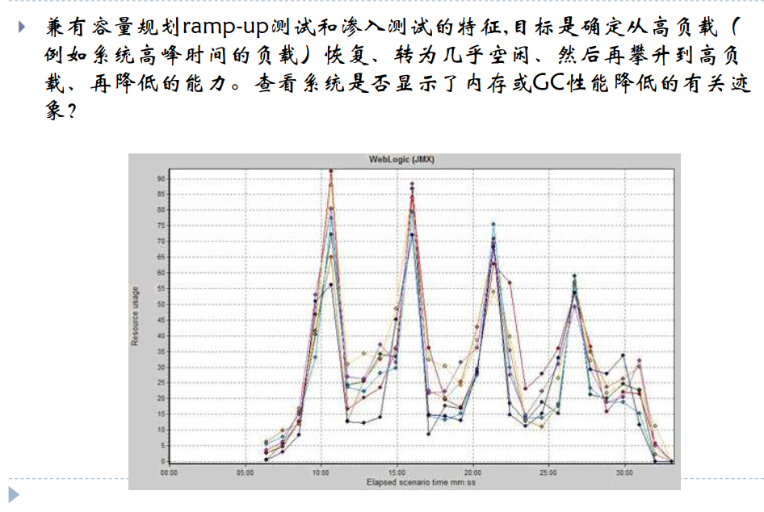
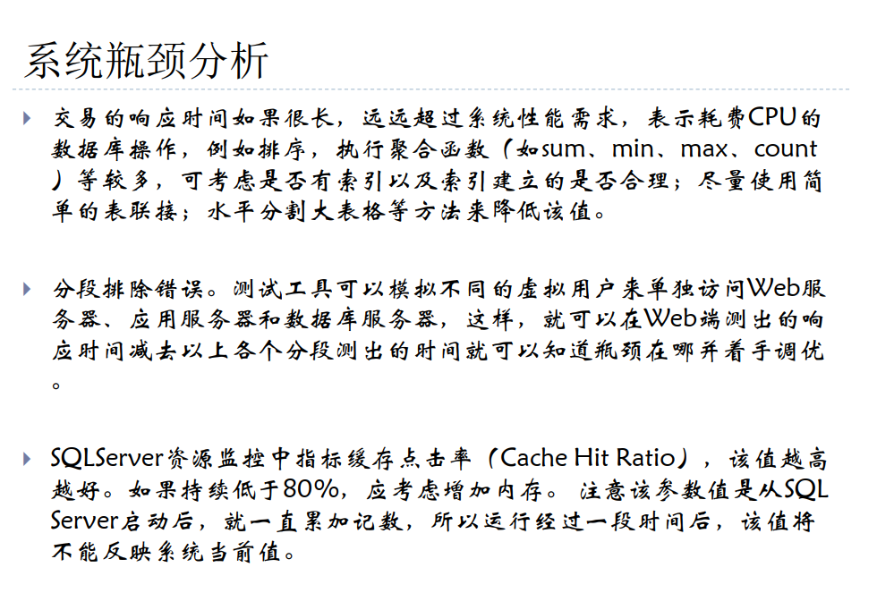
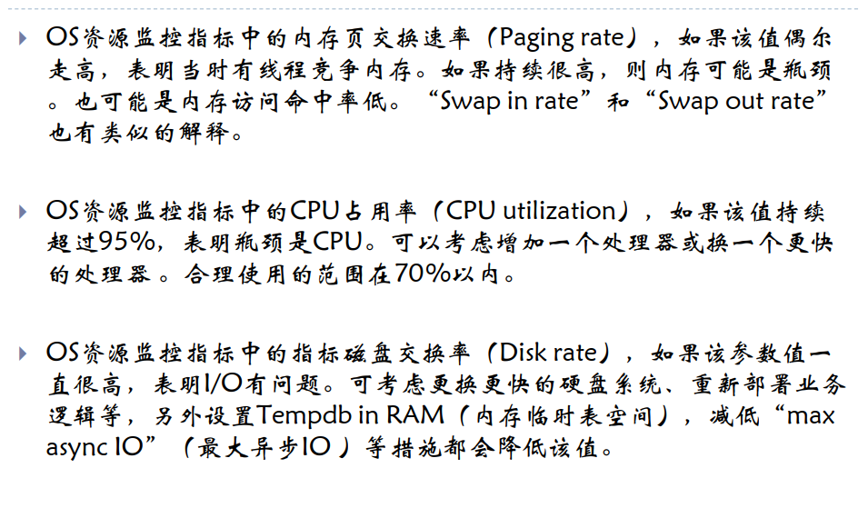
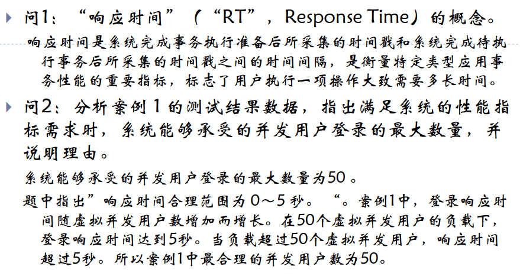
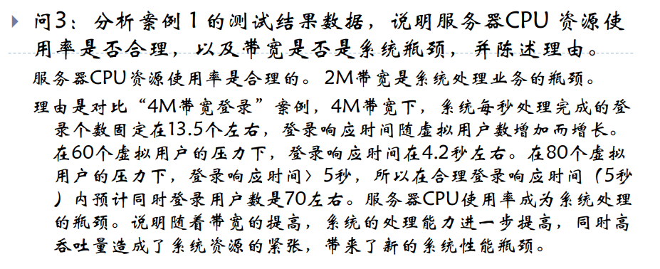

[TOC]

# 常用测试

## 几种常用系统测试

- 性能测试，负载测试，压力测试

  - 为获取或验证系统性能指标而进行的测试，负载是通过增加负载来发现系统中所存在的性能问题，压力测试是在高负载下对系统稳定性进行测试，性能测试常与这两种测试结合进行，

  - 性能测试包括方面：

    - 评估系统能力，识别体系中的弱点，系统调优，检测软件中的问题，验证稳定性，可靠性等

    - 依据：需求+经验

    - 指标：CPU，内存占用率，网络流量，并发性能，辅助存储区（如缓冲区，工作区大小等），处理精度等，吃用性能测试工具进行测试

    - 测试要点：测试环境应与生产环境一致，一般用测试工具和脚本未完成，重点是对前期数据的设计和后期数据分析，测试用例一旦生成，改动不大，可重复使用

    - 方法：两种负载类型

      - flat类型：一次加载所有负载，然后再预定的时间段内持续运行，然后取测试性能指标的平均值
      - ramp-up类型：负载是交错上升的，这种测试不能产生精确的和可重现的平均值，这是因为由于负载的增加时每次一部分，系统的负载在不断地变化，优点是，可以看出随着系统负载的改变，测量值是如何改变的，据此选择要运行的flat测试的范围
      - flat波动效应：在系统各个方面都有所体现

      

      - 解决方法：测试时间长一点，这样由于是随机事件，时间长了，吞吐量会被拉平；或者取波形两个平息点之间的测量值，这个缺点是可捕获数据的时间非常短。

    - 对于企业级

      - 基准测试：强调要获得一致的，可再现的结果

        -   与服务器通信的用户越多，负载就越大。同样，请求之间的间隔时间越短，负载也越大。这两因素的不同组合会产生不同的服务器负载等级。这时用基准测试，就可对响应时间和吞吐量 获得可再现的结果。  
        - 

      - 性能规划测试

        - 目标：找出在特定条件下，给定应用程序的性能可以达到何种程度，通常具体的目标是找出系统在特定服务器响应时间下支持的当前用户的最大数。
        - 要确定系统的容量，要考虑下列因素
          - 用户中有多少是并发通信的
          - 每个用户的请求时间间隔是多少
        - 最好的方法是模拟高峰时间用户与服务器通信的状况
        - 什么是确定容量的好方法
          - 集合两种负载类型的优点，并运行一系列的测试

      - 渗入测试

        - 是一种比较简单的性能测试，时间较长
        -   它使用固定数目的并发用户测试系统的总体健壮性。这些测试将会通过内存泄漏、增加的垃圾收集(GC)或系统的其他问题，显示因长时间运行而出现的任何性能降低  
        - 建议运行两次测试：一次使用较低的用户负载  （要在系统容量之下，以便不会出现执行队列）  ，一次使用较高的负载  （以便出现积极的执行队列）  

      - 峰谷测试

        

  - 负载测试：

    - 模拟实际软件系统真实负载条件，通过不断加载，观察不同负载下系统的响应时间和数据吞吐量等，以检验系统的行为和特性，以发现系统可能存在的性能瓶颈，内存泄漏，不能实时同步问题
    - 目标：确定在各种工作负载下系统的性能

  - 强度测试

    - 检验系统能力的最高实际限度，是检查在系统运行环境不正常乃至发生故障的情况下，系统可以运行到何种程度的测试

    - 进行强度测试时，让系统的运行处于资源的异常储量，异常频率和异常批量的条件下

    - 本质上测试者是想要破坏程序

    - 环境：

      - 压力稳定测试：给定压力，持续24小时以上
      - 破坏性加压测试：不断加压，造成系统崩溃或让问题暴露

    - 通常黑盒，需要记录，难定位，不要重做系统

    - 类型

      - 并发性能测试：入口为客户端，在压力测试中比较重要
      - 疲劳强度测试：最大用户数，运行一段时间，原则是保证系统长期运行不间断
      - 大数据量测试：存储，统计，查询等业务
      - 瓶颈分析

      

      

- 问题例子

  

  

- 安全测试，可靠性测试
- 兼容性测试

## 用户文档测试

## 配置测试

## 本地化测试

## 易用性测试

## 基于应用服务器的测试

##  α 测试和β 测试  

## 实时系统测试

## 其他测试

## 调试