### 软件错误和软件失效

- ”错误“：在没特别加以说明的情况下，是泛用的概念，包括蛋蛋不仅限于bug，error，fault，failure，crash，problem
- 软件出错机理可以分为
  - **软件错误error：不可接受的人为操作，其结果是导致软件缺陷的发生**
  - **软件缺陷bug：存在于软件中的不可接受的偏差，其结果是软件运行至某一特定情况时发生软件故障**
  - **软件故障fault：软件运行过程中出现的不可接受的内部状态，若不及时制止，便产生软件失效**
  - **软件失效failure：软件运行时产生的一种不希望或者不可接受的外部行为结果**

-  软件缺陷激活条件
  - **软件未达到产品需求说明书指明的要求**
  
  - **软件出现产品需求说明书指明不会出现的错误**
  
  - **软件功能超过产品需求说明书指明的范围**

  - **软件未达到产品需求说明书未提及但应达到的功能**
  
  - **测试人员认为难以理解，不易使用，运行缓慢，或者最终用户认为不好的问题**
  
    
  
- 软件缺陷的特征
  - 看不到--缺陷不易找到
  - 看到但抓不到--发现了缺陷，但不易找到问题发生的原因所在

#### 软件错误分类(不重要)

- 按照错误的影响和后果分类：
  1. 较小错误：输出格式不正确
  2. 中等错误：对系统运行局部有影响
  3. 较严重错误：明显的不合理现象，不可靠输出
  4. 严重错误：系统时好时坏
  5. 非常严重的错误：系统运行突然停机，不知原因
  6. 最严重的错误：系统运行造成事故或者造成生命财产损失
- 按错误的性质和范围分类
  1. **功能错误：**
     - 规格说明错
     - 功能错误
     - 测试错误
     - 测试标准引起的错误：对测试的标准要选择适当
  2. **系统错误**
     - 外部接口错误
     - 内部接口错误：指程序之间的联系
     - 硬件结构错误：不能理解硬件工作而导致的错误
     - 操作系统错误：不了解操作系统工作机制而导致的错误
     - 软件结构错误：由于软件结构不合理或不清晰引起的错误
     - 控制与顺序错误：不正确的操作顺序导致错误
     - 资源管理错误：不正确使用资源导致
  3. **加工错误**
     - 算术与操作错误
     - 初始化错误
     - 控制和次序错误：类似系统错误中的控制与书顺序错误
     - 静态逻辑错误
  4. **数据错误**
     - 动态数据错误
     - 静态数据错误
     - 数据内容错误
     - 数据结构错误
     - 数据属性错误
  5. **代码错误：**主要包括语法错误，打字错误等
- 按软件生存期阶段分类
  1. **问题定义（需求分析）错误**
  2. **规格说明错误**
     - 不一致错误
     - 冗余错误
     - 不完整性错误
     - 不可行错误
     - 不可测试错误
  3. **设计错误**
     - 设计不完全错误
     - 算法错误
     - 模块接口错误
     - 控制逻辑错误
     - 数据结构错误
  4. **编码错误**

#### 软件缺陷的产生

- 技术问题
- 团队问题
- 软件本身

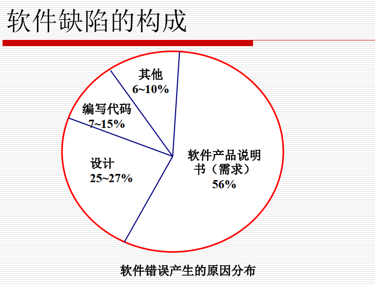

软件缺陷的产生：

- 用户的计算机知识较少
- 要开发产品的特性不够清晰
- 需求变化的不一致
- 对需求说明书不重视
- 项目组成员间缺少沟通 

软件缺陷的状态

  为便于跟踪和管理某产品的缺陷，可以定义不同的软件缺陷状态:

- **激活状态(Active或Open)**：问题还没解决，测试员报的bug、或验证后bug仍然存在。
- **已修正状态(Fixed或Resolved)：**开发人员针对缺陷，修改程序，认为已解决问题，或通过单元测试。
- **关闭或非激活状态(Close或Inactive)：**测试员验证Fixed bug后，确认bug已改的状态。
- **Hold状态：**  第三方产品引起的、或是无法解决的bug。
- **Differed状态：**不需解决或准备在下版中解决的bug。  

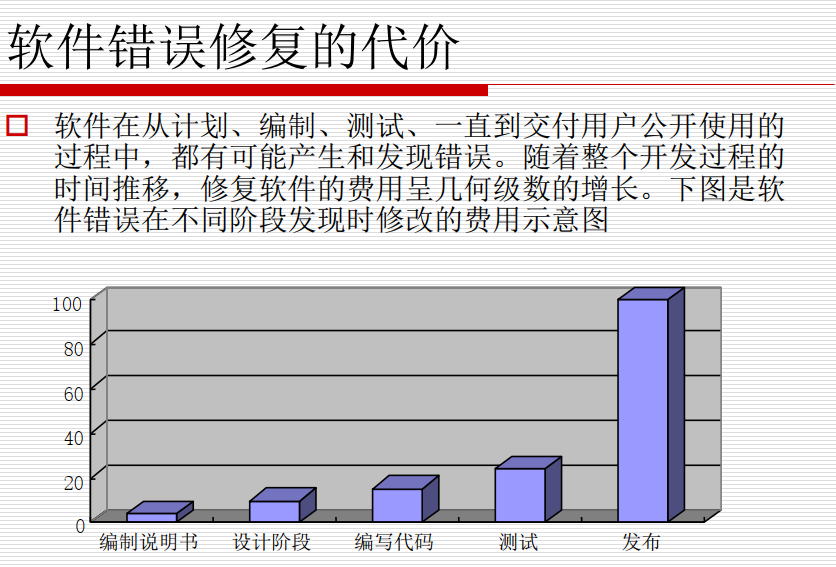

软件可靠性问题

- 软件可靠性定义：

  **IEEE将软件可靠性定义为：在给定时间间隔内和特定的环境下软件按规格说明成功运行的概率**

- 软件可靠性的主要指标

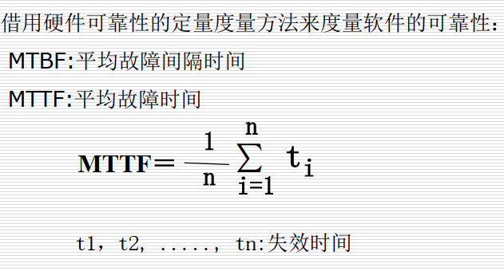

- 因软件设计故障与因计算机硬件设计故障而引发的系统失效的比例大约为：10：1
- 运行软件的驻留故障密度（每千行代码的故障数目）：
  - 要求很高的关键财务或财产软件为：每千行代码 1～10个故障
  - 关键的生命软件为：每千行代码0.01～1个故障

**软件可靠性是对软件在设计、开发以及所预定的环境下具有能力的置信度的一个度量，是衡量软件质量的主要参数之一。**

**软件测试则是保证软件质量、提高软件可靠性的最重要手段。**  

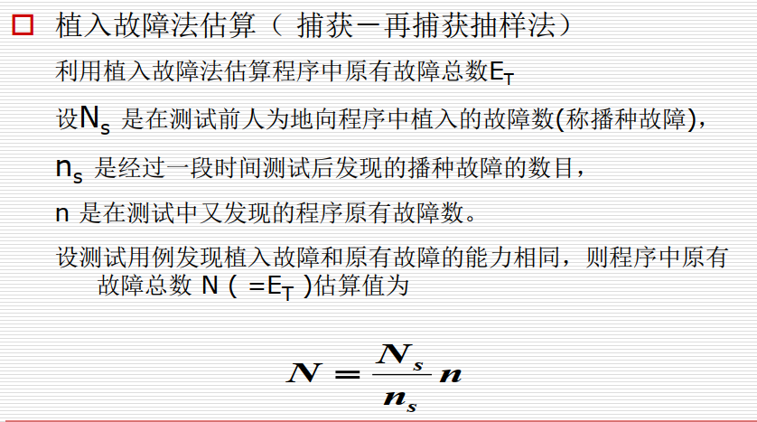

  如果bi很大，应当每隔一段时间，由两个测试员再分别测试，分析测试结果，估算B0。如果bi减小，或几次估算值的结果相差不多，则B0作为原有错误总数的估算值。  

### 软件测试概述

#### 软件测试的发展（略）

#### 软件测试的定义

- 一般定义

  - IEEE定义：  1983年， IEEE提出的软件工程标准术语中给软件测试下的定义：

    - 软件测试是使用人工的或自动的手段来运行或检测某个系统的过程, 其目的在于检验它是否满足约定的需求或是比较预期结果与实际结果之间的差别。
      
    - 1990年的IEEE/ANSI标准将软件测试进行了这样的定义：(IEEE/ANSI, 1990 [Std 610.12-1990])

    就是在既定的状况条件下，运行一个系统或组建，观察记录结果，并对其某些方面进行评价的过程。 (这里所谓“既定的状况” 也可理解为需求或设计)
    

**这一定义非常明确地提出了软件测试以检验是否满足需求为目标。**  
    
  - Myers定义：  **软件测试是为了发现错误而运行程序的过程**。这一定义明确指出软件测试的目的是“发现错误” 。  
  
- 广义定义：**广义的软件测试定义包括：确认、验证、测试**

- 相关术语：测试用例，测试步骤，精确和准确，确认和验证（做的东西正确，做得正确）

  #### 软件测试的对象

  **软件测试并不等于程序测试，软件测试贯穿于整个软件定义与开发期间**

  **故需求分析，概要设计，详细设计以及程序编码等各阶段所得到的文档，包括需求规格说明，概要设计规格说明，详细设计规格说明以及源程序，都应该是软件测试的对象**

  

  #### 软件测试的重要性

  - 软件错误不可避免
  - 软件测试应无处不在

  #### 软件测试的分类

  1. 按测试过程（开发阶段）

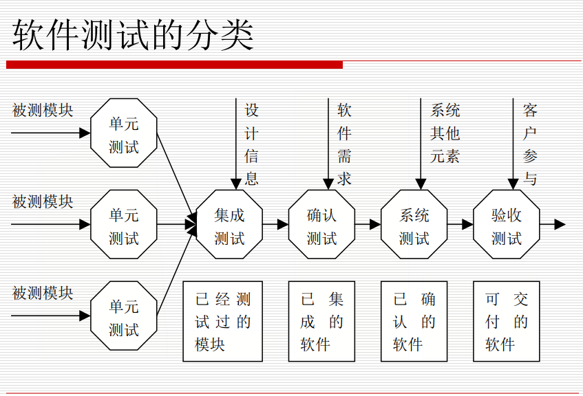

2. 按测试用例设计方法
   - 白盒测试
     - 也叫结构测试或逻辑驱动测试。他是从程序的控制结构出发进行的测试，测试程序中的每条通路是否都有能按预定要求正确工作，而不顾它的功能
   - 黑盒测试
     - 又称功能测试，数据驱动测试或基于规格说明书的测试，是一种从用户观点出发的测试，在已知产品所应具有的功能通过测试来检测每个功能是否都能正常使用
   - 灰盒测试
     - 是介于白盒测试和黑盒测试之间的测试，灰盒测试关注输出对于输入的正确性，同时也关注内部表现，但这种关注不像白盒那样详细，完整，只是通过一些表征性的现象，时间，标志来判断内部的运行状态
3. 按实施对象
   - alpha测试（企业内部测试）
   - beta测试（最终用户测试）
   - 第三方测试（独立测试）
4. 按执行方式
   - 人工测试 
   - 自动化测试
5. **按测试方式划分**
   - **静态测试：主要特征是在用计算机测试源程序时，计算机并不是真正运行被测试的程序，只对被测程序进行特性分析**
   - **动态测试：主要特征时计算机必须真正运行被测程序，通过输入测试用例，对其运行情况（输入、输出的对应关系）进行分析**
6. 按测试形态分
   - 建构性测试
     - 包含：单步测试，尝试性测试，单元测试，组件测试，集成测试等
   - 系统测试
     - 包含：集成测试，前哨测试，功能测试，设置测试，发行测试，验收测试等
   - 特殊测试
     - 回归测试，压力测试，兼容性测试，性能测试，Alpha和Beta测试

#### 软件测试的目的

  软件测试的目的决定了如何去组织测试。

- **如果测试的目的是为了尽可能多地找出错误，**那么测试就应该直接针对软件比较复杂的部分或是以前出错比较多的位置。
- 如果测试目的是为了给最终用户提供具有一定可信度的质量评价，那么测试就应该直接针对在实际应用中会经常用到的商业假设。  
  
-  软件测试是程序的执行过程，目的在于发现错误；
  - 测试是为了证明程序有错，而不是证明程序无错误
-  一个好的测试用例是在于它能发现至今未发现的错误；
- 一个成功的测试是发现了至今未发现的错误的测试。  

#### **测试的原则**

1. 测试只是展示缺陷

   - 测试只能表明缺陷存在，却不能证明没有缺陷

2. 穷尽测试是不可能的

   - 测试所有的输入和条件组合式不可能的
   - 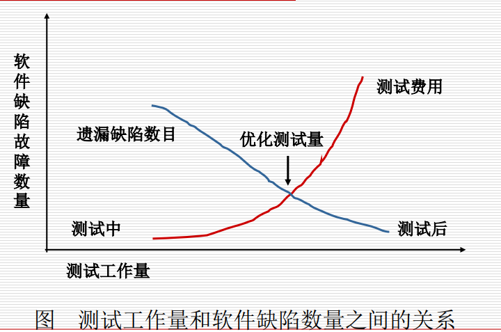

   - 尽早测试：要较早发现缺陷，越早发现我问他，解决的代价就越小
   - 缺陷簇生：要对缺陷发现率高的模块投入更多的测试，少量的模块往往隐藏了大部分缺陷
   - 杀虫剂悖论：相同的测试再重复多次之后就无法再找到缺陷了，要克服“杀虫剂悖论”，测试用例要不断进行评审
   - 测试时上下文相关的：测试再不同上下文环境中的执行是不同的。
   - 无错谬论：假如建立的系统不稳定或不能满足用户需要和期望，那么发现和修复缺陷就毫无帮助了

3.   其它测试原则

   - 测试用例应由测试输入和与之对应的预期输出结果两部分组成。
   - 程序员应避免检查自己的程序。（注意不是指对程序的调试）
   - 在设计测试用例时，应当包括合理的输入条件和不合理的输入条件。不合理的输入条件是指异常的，临界的，可能引起问题异变的输入条件。
   - 严格执行测试计划，排除测试的随意性。测试计划应包括：所测软件的功能，输入和输出，测试内容，各项测试的进度安排，资源要求，测试资料，测试工具，测试用例的选择，测试的控制方法和过程，系统的组装方式，跟踪规则，调试规则，以及回归测试的规定等等以及评价标准  
   -   妥善保存测试计划，测试用例，出错统计和最终分析报告，为维护提供方便。
   - 应当对每一个测试结果做全面的检查。
   - 对测试结果要有一个确认过程。A测出的错误由B确认。严重的错误可召开评审会进行讨论和
     分析。
   - 软件测试必须基于“质量第一”的思想去开展各项工作，当时间和质量冲突时，时间服从质量。  
   -   并非所有软件缺陷都要修复
     原因：没有足够的时间进行修复；修复的风险较大； 不值得修复；可不算做故障的一些缺陷；“杀虫剂现象”。结论：关键是要进行正确判断、合理取舍，根据风险分析决定哪些故障必须修复，哪些故障可以不修复  
   
4. 基本测试过程（详细的要写一下）

   1. 基本测试过程
      - **计划与控制**
      - **分析与设计**
      - **实施与执行**
      - **评估出口准则和报告**
      - **测试结束活动**

   

5. 测试计划和控制

   - **计划：定义测试目标及测试活动规格说明以满足特定目标和使命的过程**（什么人，在什么时间内，根据什么，做什么）IEEE829测试计划规格说明书提供了指导性建议
   - **控制：是持续比较实际进展和计划的活动，并报告状态，比如实际和计划的偏离**（持续跟踪测试活动的进度，及时发现与计划的偏差，并采取措施消除偏差或修改计划）

6. **测试分析和设计**

   **是将抽象测试目标转化为具体有形测试条件和测试用例的过程，，包含以下主要任务：**

   - 评审测试依据：如需求文档，软件完整性级别（风险级别），风险分析报告，架构设计，设计，界面规格说明书
   - 评估测试依据和目标的可测试性
   - 基于测试项，规格说明，行为和软件结构进行分析并确定测试条件以及优先级
   - 设计高级测试用例并确定优先级
   - 确定必要的测试数据来支持测试条件和测试用例
   - 设计测试环境并确定所需的基础设施和工具
   - <u>**建立测试依据和测试用例间的双向可追溯性**</u>

7. 测试实施和执行

   是结合测试用例确定1测试规程，脚本以及执行顺序，建立测试环境并运行测试的过程。可以将该定义分为两个方面来看，测试实施是搭环境选用例，测试执行就是所谓的跑测试

   - 注意测试规程，脚本和用例的区别：用例是高级抽象的，也可以是具体可遵照执行的，而测试用例中可以遵照执行的额动作序列就是测试规程，脚本特指自动化脚本，

   测试实施和执行包含以下主要任务

   - 确定，实施测试用例包括确定数据，以及制定优先级
   - 开发测试规程及制定优先级，创建测试数据，和准备测试用具及自动化脚本
   - 根据测试规程创建测试用例集合以达到高效测试的目的
   - 验证测试环境搭建正确
   - **验证和更新测试依据和测试用例间的双向可追溯性**
   - 根据预定的执行次序使用手工方式或工具执行测试规程
   - 记录测试执行的输出，被测试软件的版本或标示，测试工具和测试件
   - 比较真实结果和预期结果
   - 将（真实结果和预期结果）比较的差异作为事件来报告，并且分析其原因（比如代码缺陷，测试数据，测试文档或测试的错误执行方法等）
   - 重复执行引起执行差异的测试活动，比如重测试上次失败的测试来确认缺陷是否被修复了（确认测试），执行改正后的或原有的测试以确定修复缺陷的代码没有引入或揭示新的缺陷（回归测试）

8. 评估出口准则和报告

   评估出口准则是指将测试执行与先前定义目标做比较评估的活动。这对于每个测试级别都有效。分析出口准则包括以下主要任务：
   ■将测试日志和测试计划中规定的出口准则做比较口确定是否需要更多的测试或者修改规定的出口准则为相关方提供测试总结报告
   测试出口准则不是一成不变的，根据实际情况要不断修正。比如原来规定的是所有bug都要修复，但在项目进行当中发现时间不够，可以通过某些正式的流程将出口准则修改为修复“普通”以上级缺陷。

9. 测试结束活动
   测试结束活动指的是从己完成的测试活动中整理经验，测试件和事实数据等。
   测试结束活动发生于某些项目里程碑，如当软件系统发布，软件项目完成（或取消），一个里程碑达成，或一个维护版本发布。
   测试结束活动包括以下主要任务：
   检查计划交付物都已经交付
   关闭时间报告或提交修改记录
   编写系统验收文档
   口完成和打包测试件，测试环境和测试基础设施，以便未来重用

   将测试件交付给维护组
   分析经验教训以确定将来项目所需要的改进
   用收集的信息来增进测试成熟度

1. **测试独立性**

   一定程度的独立性常使测试人员能更有效地发现缺陷和失效。但是独立性也不能取代对系统的熟悉

   - **被测试软件开发者来设计测试（最低独立性）**
   - **其他人（比如其他开发人员）来设计测试**
   - **同组织内其他组的人员（比如独立测试组）或测试专业人员（比如可用性或性能测试员）来设计测试**
   - **不同组织或公司的人员（外包或外部授权体）来设计测试**  

2. 测试信息流程

   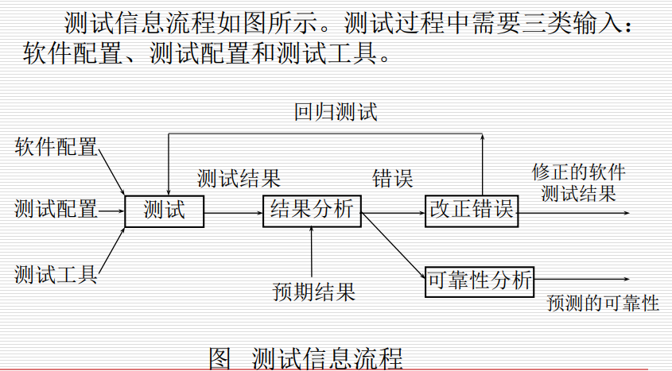

3. 软件测试的周期性

   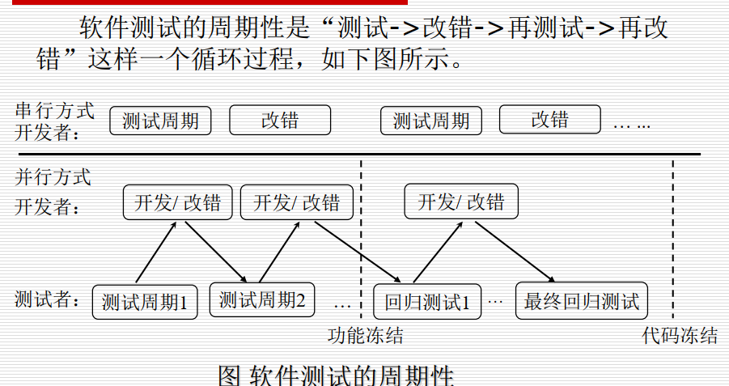

4. 软件测试技术概要
   - 软件测试的策略：就是测试将按照什么样的思路和方式进行。通常，软件测试要经过单元测试，集成测试，确认测试，系统测试以及验收测试
   - 软件测试技术
     - 白盒测试和黑盒测试
     - 静态测试和动态测试
     - 传统测试方法和面向对象测试的方法
     - 特定环境及应用的测试

5. 软件测试误区
   - 如果发布的软件有质量问题， 那是软件测试人员的错。
   - 软件测试技术要求不高， 至少比编程容易多了。
   - 有时间就多测试一些， 来不及就少测试一些。
   - 软件测试是测试人员的事， 与开发人员无关。
   - 根据瀑布模型， 测试是开发后期的一个阶段。  

6. 软件测试人员应具备的素质
   - 测试人员在开发团队中讨人厌
   - 测试人员目标：发现潜在的软件缺陷
   - 保持团队和谐
   - 应具备的素质
     - 探索精神
     - 故障排除能力
     - 不懈努力
     - 创造性
     - 追求完美
     - 判断准确
     - 老练稳重
     - 说服力

7. 道德规范

     参与测试的个人会接触到保密和需要权限才能了解的信息。一套职业道德规范可以保证这些敏感信息不会被滥用。

   - 公共：认证软件测试员的行为应当与公共利益一致
   - 客户和雇主：认证软件测试员的行为应当符合客户和雇主的最大利益，并与公共利益一致
   - 产品： 认证软件测试员应当保证他们的提交物（测试的产品和系统）符合可能的最高职业标准
   - 判断：认证软件测试员的职业判断应当具有正直的品格和独立性
   - 管理：认证软件测试经理应当在软件测试管理中遵循和推广符合职业道德的工作方式  
   - 职业：认证软件测试员应当不断推进本身的职业正直品格和声誉，并符合公共利益
   - 同事： 认证软件测试员应当公平对待并支持他们的同事，并增进与软件开发人员的合作
   - 自身： 认证软件测试员应当参与与之I作实践相关的终身学习，并提高工作时间的职业道德工作方式  

### 软件测试的模型

#### V模型

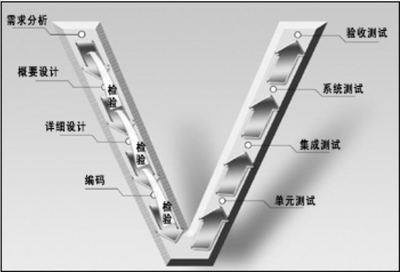

- V模型描述了一些不同的测试级别，并说明了这些级别所对应的生命周期中不同的阶段

图中左边下降的使开发过程各阶段，右边上升的是测试的各个阶段

- 成功应用V模型的关键因素是设计测试案例的时机

- 价值

  它非常明确地标明了测试过程中存在的不同级别，并且清楚地描述了这些测试阶段和开发过程期间各阶段的对应关系

  -   单元测试的主要目的是针对编码过程中可能存在的各种错误，例如用户输入验证过程中的边界值的错误。
  - 集成测试主要目的是针对详细设计中可能存在的问题尤其是检查各单元与其它程序部分之间的接口上可能存在的错误。
  - 系统测试主要针对概要设计，检查了系统作为一个整体是否有效地得到运行，例如在产品设置中是否达到了预期的高性能。
  - 验收测试通常由业务专家或用户进行，以确认产品能真正符合用户业务上的需要。 

- 问题

  - 测试时开发之后的一个阶段
  - 测试的对象是程序本身
  - 易导致需求阶段对的错误一直到最后系统测试阶段才被发现

#### W模型

- **V模型的改进，在概要设计、详细设计和编码每个步骤都进行检测，尽量将问题即使发现，及时消灭**
-   W模型是基于IEEE std 1012-1998《软件验证和确认（V&V） 》原则提出。此原则主要思想是**“尽早地和不断地进行软件测试”**。  
- 
- **测试伴随整个开发周期**，相应的开发活动完成，即可对相应的开发活动进行测试
- 测试对象不仅是程序，还包括需求和设计
- 优点：强调了测试计划等工作的先行和对系统需求和设计的测试
- 缺点：没有对软件测试流程予以说明

#### H模型

- V和W的缺陷

  - 串行，但很多活动可以并行

  - 在实际开发过程中，严格的阶段划分只是一种理想状态

  - 没有很好地表示测试流程的完整性，测试流程大致可分为测试准备活动和测试执行活动

  - H模型将测试作为以恶搞独立流程，贯穿整个开发周期，与其他流程并行，同时测试准备和测试执行分离

    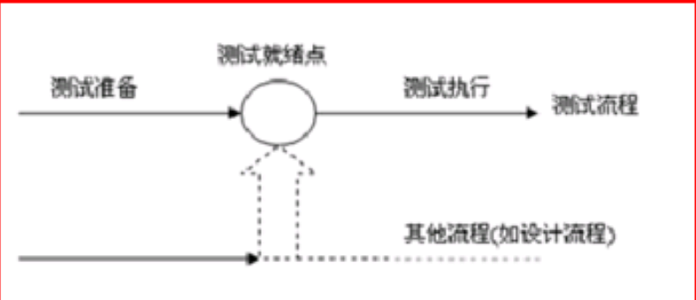

  - 特性

    - 测试不仅仅是指测试的执行，还包括许多其他活动
    - 测试是一个独立流程，贯穿整个生命周期，并发执行
    - 测试要尽早准备，尽早执行
    - 测试是根据被测对象的不同而分层进行

  - 意义

    - 测试准备和测试执行分离，有利于资源调配，降低成本，提高效率
    - 充分体现测试过程（不是技术）的复杂性
    - 有组织、有结构化的独立流程，有助于跟踪测试投入的流向

#### X模型

  Brian Marick对V模型的质疑主要有：

- V模型无法引导项目的全过程。 他认为一个模型应能处理开发的所有方面，包括交接，频繁重复的集成，以及需求文档的缺乏等。
- V模型基于一套必须按照一定顺序严格排列的开发步骤，而这很可能并没有反映实际的实践过程。
- 质疑了单元测试和集成测试的区别，因为在某些场合人们可能会跳过单元测试而热衷于直接进行集成测试。按照V模型所指导的步骤进行工作，某些做法并不切合实用  
- 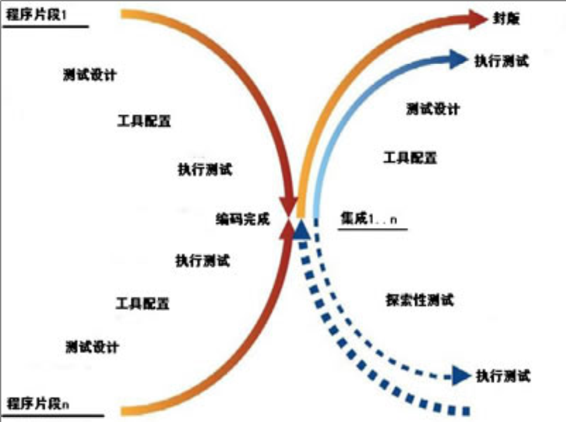
- 左边是针对单独程序片段所进行的相互分离的编码和测试
- 此后将进行频繁的交接，通过集合最终合成为可执行的程序（右上）
- 定位了探索性测试（右下）
- V模型明确了需求角色的确认，但是X模型并没有，这是其不足之处
-   X模型并不要求在进行作为创建可执行程序（图中右上方）的一个组成部分的集成测试之前， 对每一个程序片段都进行单元测试（图中左侧的行为）。但X模型没能提供是否要跳过单元测试的判断准则。  

#### 前置模型

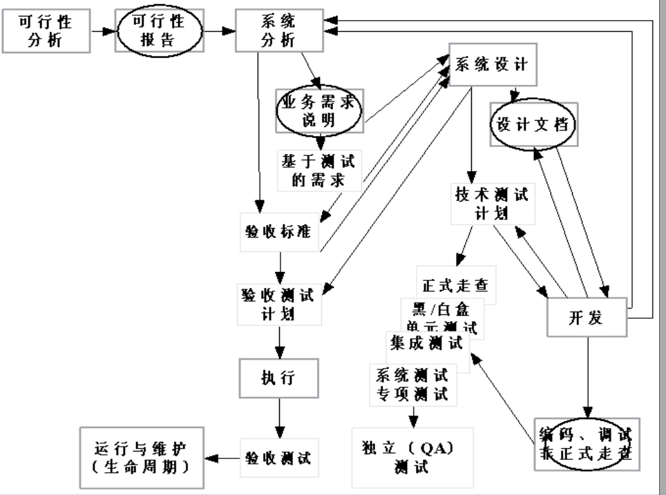

- **开发和测试相结合**
- **对每一个交付内容进行测试：每一个交付的开发结果都必须通过一定的方式进行测试**
- **在设计阶段进行计划和测试计划：设计阶段是做测试计划和测试设计的最好时机**
- 测试和开发结合在一起，前置测试将测试执行和开发结合在一起，并在开发阶段以编码-测试-编码-测试的方式来体现，也就是说，程序片段一旦编写完成，就会立刻进行测试
- 让验收测试和技术测试保持相互独立：验收测试应该独立于技术测试，这样可以提供双重的保险，以保证设计及程序编码能够符合最终用户的需求
- 反复交替的开发和测试：开发和测试需要一起反复交替执行
- 发现内在的价值：前置测试能给需要使用测试技术的开发人员、测试人员、项目经理和用户等带来很多不同于传统方法的内在的价值。  

#### 测试模型的使用

- 任何模型都不完美，不应该为了使用模型而照搬
- 实际测试中应灵活运用各模型优点，  **通常在W模型框架下，运用H模型的思想进行独立测试。当有变更时，按X模型和前置模型的思想进行处理。**  
- 测试和开发密不可分，寻找恰当地就绪点开始进行测试，并反复进行迭代测试，以达目标 