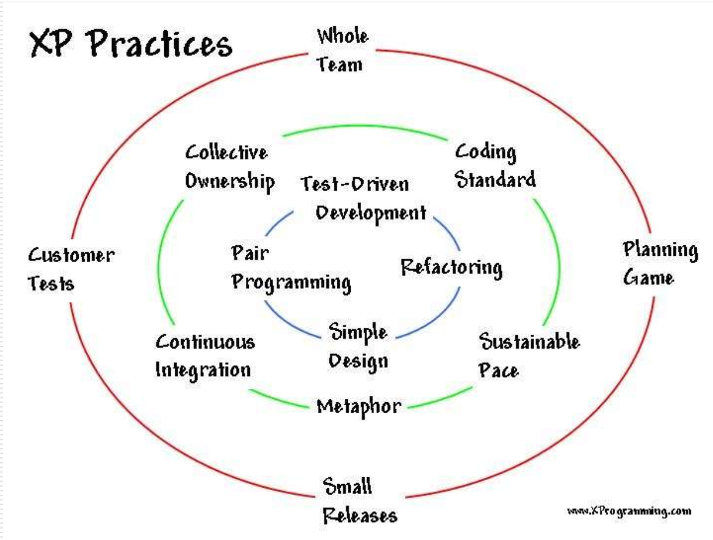
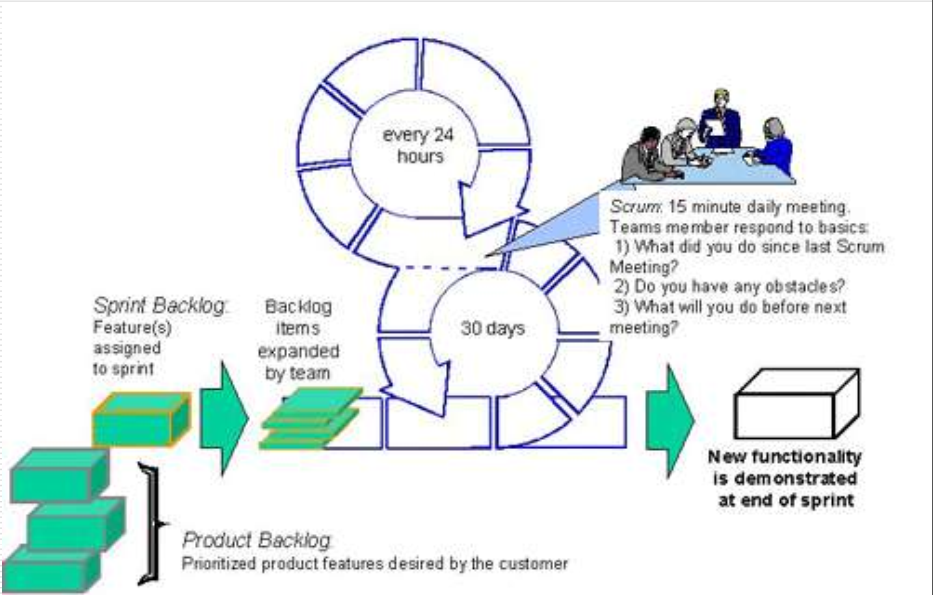
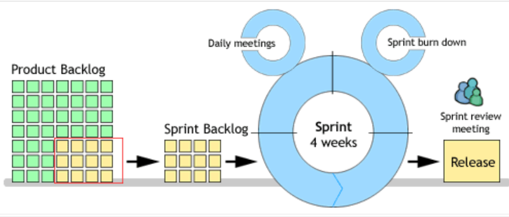

## 软件质量概述

###  1质量和软件的概念

#### 1.1 什么叫质量

1. 定义：ISO9001:2008:<u>**一组固有特性满足要求的程度**</u>

   不同人对质量的要求不一样

2. 特性：可区分的特征，可以是固有的或赋予的，可以是定性的或定量的，有其他各种类别的特性
3. 要求：明示的、通常隐含的或必须履行的需求或期望
4. **质量具有经济性（达到用户需求，消耗最小代价）、广义性、时效性、相对性（不同人关注点不同）**
5. 人们是如何认识质量的？
   - 狭义：就是指产品质量（面向一般人）
   - 广义：包括产品质量和工作质量两个组成部分，即全面质量（专业人士）
6. 对产品的解释
   - 过程的结果（ISO9000定义）
   - 产品可以分为四种类别，即硬件、流程性材料、软件、服务或它们的组合（ISO8402）
     - 硬件：是不连续的具有特定形状的产品：如彩电，电视
     - 流程性材料：是原料转换为某一预定状态的有形产品，如流体，气体等，其典型交付方式为桶装、袋装或者通过管道等
     - 软件：是通过支持媒体表达的信息所构成的一种智力创作，形式如：概念、信息、计算机程序等
     - 服务：是为满足客户的需要，提供方和顾客之间在接触时的活动，以及供方内部活动的结果
   - 产品可以是有形的，也可以是无形的，或者是它们的组合
   - 产品是可以预期的（如提供给顾客）或非预期（如产生了不愿意有的后果）

####  1.2影响质量的因素

五大因素：人（态度和技能是第一位的），机器（设备），物（材料），方法，环境

#### 1.3质量目标

在质量方面所追求的目的。质量目标是产品和工程质量在一定时间内可达到的水平

####  1.4 质量成本

将产品质量保持在规定的质量水平上所需的有关费用。质量成本由运行质量成本和外部质量保证成本构成，前一个指的是企业为保证和提供产品质量而支付的一切费用以及因为质量故障所造成的损失费用之和，后一个指的是用户提供所要求的客观证据所支付的费用。

- **运行质量成本包含：**
  1. 预防成本（防止产品不达标）
  2. 鉴定成本
  3. 内部缺陷成本（废品，不达标产品）
  4. 外部缺陷成本（如名誉上的损毁，造成客户流失）

- 外部质量保证成本主要包括
  1. 为提供特殊附件的质量保证措施、程序、数据所支付的费用
  2. 产品的验证试验和评定的费用
  3. 满足用户要求，进行质量体系认证所发生的费用

####  1.5质量管理

不仅从技术层面上去思考产品质量，也从质量管理的角度去思考

#### 1.6软件和软件产品

#####  1.6.1软件的含义

软件=程序（数据）+文档+服务

##### 1.6.2 软件产品的组成

1. 程序代码
2. 帮助文件
3. 用户手册
4. 样本和示例
5. 标签
6. 产品支持信息
7. 图标和标志
8. 错误信息
9. 广告与宣传材料
10. 软件的安装
11. 软件说明文件
12. 测试错误提示信息

##### 1.6.3软件产品和其他产品的差异

- 软件是逻辑产品不是实物
- 功能依赖于硬件和运行环境，个人操作
- 对软件产品的要求一般来说比有形的产品要复杂

###  2软件生命周期

#### 2.1软件开发项目组

- 项目管理经理：全程负责整个软件项目的开发
- 系统设计师：设计整个系统构架或软件构思
- 程序员：设计开发，改bug
- 测试人员、QA：负责找bug，并反馈给开发人员
- 技术制作、用户助手，手册和文档编人员：负责整体软件文档编写
- 结构管理和制作人员：负责将程序员编写的全部文档资料合并成一个软件包？？？？？？

#### 2.2软件生命周期质量管理

质量形成于过程

##### 2.2.1概述

**瀑布模型：**

**定义阶段**

1. **计划（可行性研究与计划）**
2. **需求分析**

**开发阶段**

3. **设计**（概要加详细）
4. **编码实现**
5. **测试**

**维护**

6. **运行与维护**

#####  2.2.2 需求分析

了解、分析客户需求，确定软件产品所能达到的目标

- 主要工作

  略，后面再写

  **其中用户概要手册不是在结束写**

- 应完成的文档

  - 可行性报告
  - 项目初步开发计划
  - 需求规格说明（产品描述）
  - 用户手册概要
  - 测试计划

- 其他

  - 配置管理
  - 评审

##### 2.2.3设计

根据需求分析的结果，考虑如何在逻辑、程序上去实现所定义的产品功能、特性等。可分为概要设计和详细设计

设计过程将需求转换成软件表示，设计的结果将作为编码的框架和依据

- **概要设计主要工作**
  - 建立系统总体结构，划分功能模块
  - 定义各功能模块接口
  - 数据库设计（如需要）
  - 指定组装测试计划
- **详细设计主要工作**
  - 设计各模块具体实现算法
  - 确定模块间的详细接口
  - 指定模块测试方案
- **概要设计完成的文档**
  - 概要设计说明书
  - 数据库设计说明书（如有）
  - 组装测试计划
- **详细设计完成的文档**
  - 详细设计说明书
  - 模块测试计划

##### 2.2.4 编程

- 主要工作
  - 编程
  - 进行模块调试和测试
  - 编写用户手册
- 完成文档
  - 程序调试报告
  - 用户手册

##### 2.2.5 测试

按不同的过程阶段分为**单元测试、集成测试、功能测试**、系统测试、验证测试等。

测试过程集中于软件的内部逻辑，以及外部功能

##### 2.2.6 维护

- 交付后要修改升级，测试挑不出全部bug，用户需求可能在认识之后会变化
- 维护阶段重复定义和开发阶段的步骤，但却是在已有软件的基础上发生的。维护阶段可能会遇到四类修改需要完成：1.纠错 2.适应 3.增强 4.预防

#### 2.3软件开发模型

软件开发模型指的是软件开发全部过程、活动和任务的结构框架

UML代表着软件建模的发展趋势

#####  2.3.1瀑布模型、大棒模型、边写边改模式

1. 瀑布模型

- **优点：可以保证整个软件产品较高的质量，系统性，整体性** 。
  - 易于理解
  - 调研开发的阶段性
  - 强调早期计划及需求调查
  - 确定了合适产生可交付的产品及何时进行评审和审查
  - 强调产品测试
- 缺点：
  - 流程单一
  - 依赖需求调查
  - 没有反映出开发的迭代本质
  - 不包含风险评估
  - **风险往往后面才会显露，失去了早期纠正机会**

2. 大棒模式

   既没有规格说明，也没有经过设计，软件随着用户的需要一次又一次地不断被修改

   - 优点：简单，几乎无计划，项目成员精力基本都花在软件开发上
   - 缺点：非工程化，随意性大，最终产品不可知
   - 关于测试：有些难，有些简单

3. 边写边改模式

   在大棒模式基础上考虑了产品地要求

   - 优点：能较为迅速地展现成果，蛇和需要快速制作而且用完就扔的小项目

   - 缺点：其编码和测试可能将是长期的循环往复的过程

     

**前两种模式不会有作为测试依据的各类文档，此时可以采用称为探索测试的解决方案，另外与同类软件进行比较也是一个有效的方法**

##### 2.3.2原型模型、快速应用（RAD）模型、螺旋模式、增量模式和迭代模式、混合模式

1. 原型模型

   **基本需求分析后，快速开发出产品原型，然后基于这个原型进行沟通修改，再做详细设计和编码等，最终完成令客户满意的产品**

   一般步骤：

   - 先定义软件的总体目标，根据已知的需求规划出可实现的区域
   - 然后是“快速设计”，集中于系统的总体架构、基本功能和直观的输入方式和输出格式等
   - 用原型让客户更好理解系统，开发者边开发边评估，形成一个迭代 

   

   - 特点

     - 可克服瀑布模型的一些缺点，减少开发风险，具有显著效果
     - 浪费的成本和时间有限

     - 内部结构不重要，重要是的是必须快速建立原型，修改，反映客户需求即可
     - 可能语言和系统不满足要求，折中而已

2.  RAD模型

   **即快速应用开发模型，通过使用基于构件的开发方法来缩短产品开发的周期，提高开发的速度。RAD模型实现的前提是做好需求分析，并且项目范围明确，与原型正好相反**

3. 增量模型和迭代模型

   - **增量模型：按产品所既有的功能进行划分，先开发主要功能，在逐步增加功能完善，最后开发出一个高质量的产品**
   - **迭代模型：按产品深度或细化的程度进行划分。先将框架建立起来，不断完善或细化已有功能，与增量的目标一致**

4. 演化模型

   - 要针对事先不能完整定义需求的软件开发
   - 用户可给出待开发系统的核心需求，待实现后，反馈以支持系统的最终设计与实现
   - 可以看作重复执行的多个“瀑布模型”
   - 要求开发人员有能力根据功能的重要性对总体设计的基础结构的影响而做出判断，把项目的产品需求分解为不同组，以便分批循环开发

5. 螺旋模型

   - 在瀑布和演化模型基础上，加上两者所忽略的风险分析
   - **开始时不必定义详细的所有细节（人的认知时螺旋上升的）**
   - 每一螺旋包括五个步骤1.确定目标 2. 对方案风险进行评估，3. 进行本阶段的开发和测试 4. 计划下一阶段，5.确定进入下个阶段的方法
   - 优点：严格全过程风险管理；强调各开发阶段的质量；提供机会评估项目是否有价值继续下去
   - 缺点：可能让用户相信演化方法可控，项目的成功依赖于风险评估专门技术，如果一个大风险没有被发现和管理里，就会出现问题

6. 混合模式

   允许一个项目能沿着最有效的路径发展，实际上许多软件开发团队都是在使用几种不同的开发方法组成它们自己的混合模式。

##### **2.3.3 敏捷开发**（太多了）

+ **敏捷宣言：**

  - **个体和交互	胜过	过程和工具**

  - **可以工作的软件   胜过     面过俱到的文档**

  - **客户合作   胜过   合同谈判**

  - **响应变化    胜过   遵循计划**

    **我们认为虽然右边也有价值，但是左边的具有更大的价值**

- 敏捷方法采用迭代、增量开发的过程模型

  - 是一种以人为核心、迭代、循序渐进的开发方法
  - 组织上，软件项目的构建被切分成多个子项目，各个子项目的成功都经过测试，具备集成和可运行的特征
  - 迭代时间分为多个小周期，一般不超过两个星期

- 敏捷开发由几种轻量级软件开发方法组成：极限编程XP，Scrum，精益开发Lean Development等等

  - **极限编程XP：**

    - **主要是为降低需求变化的成本**

    - 定义了一套简单的开发流程：包括编写用户案例、架构规范、实施规划、迭代计划、代码开发、单元测试、验收测试等等

    - **提倡互动交流、反馈、简单、勇气、团队**

    - 12个最佳实践

      

  - 精益开发等

    - 核心思想：bug，没用的功能、等待以及其他对结果没有益处的东西都是浪费，分析查明源头，设法消除
    - 原则：
      - 强调学习：不断改进所开发的产品和开发效率
      - 在最后时刻做决定：避免无谓的努力
      - 用最快的速度交付用户
      - 给团队自主权
      - 诚信
      - 全局观：强调整体优化的系统
    - 精益软件更重要的是不断完善开发过程的一种思维方式

  - **Scrum：敏捷开发框架**

    由一个开发过程，几种角色以及一套规范的实施方法组成

    - 产品拥有者
    - 利益相关者：通常是客户或最终用户代表
    - Scrum专家
    - 团队成员

  - 相关名词解释

    - backlog：可以预知的所有任务，包括功能性和非功能性所有任务
    - sprint：一次迭代开发周期，一般最多30天，需要完成一个backlog，并且最终成果是一个增量的，可以交付的产品
    - sprint backlog：一个周期内需要完成的任务
    - scrumMaster：负责监督整个Scrum进程，修订计划的一个团队成员
    - time-box：一个开会的时间段，一般每个daily scrum meeting的这个时间为15分钟
    - sprint planning meeting：在启动此次sprint前召开，一般为一天时间（8小时）
    - daily scrum meeting：一般15分钟，向ScrumMaster汇报:今天做了什么，遇到什么问题，明天要做什么，让团队成员相互了解项目进度
    - sprint review meeting：团队在每个sprint结束后，将工作成果演示给负责人和其他相关人员，一般4小时
    -   Sprint retrospective meeting  ：对各个结束的sprint进行总结，项目团队开发人员参加，一般3小时
    - 

    一般迭代开发周期为30天，最终成品是一个增量的可以交付的产品

    

    

- 过程：

  - 确定Sprint Backlog

  - 召开sprint planning meeting

  - 进入sprint开发周期，每天都需要召开  Daily
    Scrum meeting  

  - 周期结束要成果演示

  - 回顾，开会总结

  - 下一次sprint

    

- **原则和方法**

  - **迭代式开发**
  - **增量交付**
  - **开发团队和用户反馈推动产品开发**
  - **持续集成**
  - **开发团队自我管理（人是敏捷开发的核心）**

- 常见问题

  - 技术负债？？？
  - 想当然认为团队里每个人都专业且富有责任心
  - 对敏捷的错误理解
  - 敏捷的门槛太高，对不成熟组织来说不太行得通
  - 绩效差的员工往往消极怠工来掩饰自己能力不足，如果没有办法帮助他们的话
  - 过分追求眼前利益，可能导致最后目标失败
  - 产品负责人承担过多责任
  - 大家对敏捷期望过高
  - 成功的敏捷开发团队一般不会成为产品开发瓶颈，但可能遭到其他团队嫉妒，演变成政治游戏
  - 敏捷过程中缺乏足够审查和平衡机制
  - 团队里工作量难以平衡，大部分是针对程序员的
  
- 总结：理论很美好，但实践起来还是由个各种各样的问题，也有可能失败

##### 2.3.4 MSF模型

1. MSF是一个经验知识库，包括：

   - 企业结构设计方案：采用交互的方式，侧重于制定长期规划，同时也能完成短期目标
   - 项目开发准则：包含组队模型和过程模型，用于建立高效的项目组，管理项目的生命周期
   - 项目设计过程和多层结构的应用程序模型：用于支持设计复杂的分布式企业应用
   - 企业信息基础设施的实施方法：使用组队模型和过程模型支持实现、操作和技术上的方案
2. MSF关注：

   - 使业务和技术目标相匹配
   - 建立明确的项目目标、角色和责任
   - 实现迭代、里程碑/检查点驱动过程
   - 主动管理风险
   - 有效地响应变化 
3. **基础原则**
   - 打造开放的通信
   - 为了实现共同的愿景努力工作
   - 授权团队成员
   - 建立明确的责任和共同分担责任
   - 交付增量价值
   - 保持灵活、期望并适应变化
   - 进行投入来提高质量
   - 从所有经验中学习
   - 与内部和外部客户学习
4. MSF观念
   - 培养对等方的团队
   - 侧重于业务价值
   - 保持解决方案的视角
   - 工艺出色
   - 持续学习
   - 将服务质量内在化
   - 做个好公民
   - 履行你的承诺
   - 

太多了

##### 2.3.5 RUP

统一过程是一个面向对象且基于网络程序开发方法论

好像有个在线指导者，可以为所有开发进行指导，以及支持

-   RUP是理解性的软件工程工具--把开发中面向过程的方面（例如定义的阶段，技术和实践）和其他开发的组件（例如文档，模型，手册以及代码等等）整合在一个统一的框架内。  

1. 动态结构：迭代式开发

   将整个软件开发周期划分为若干个周期，每个周期生成一个产品的新版本

   迭代的四个周期：

- 初始阶段：定义最终产品视图、商业模型并确定系统范围

- 细化阶段：设计并确定系统的体系结构，指定工作计划及资源要求

- 构造阶段：构造产品并继续演进需求、体系结构、计划直至产品提交

- 提交阶段：把产品提交给用户使用

  要有里程碑评估该阶段的工作，RUP的迭代开发过程是受控的

2. 静态结构：方法描述

- Workers：角色，它描述某个人或一个小组的行为与职责

- Activities：一个有明确目的的独立工作单元

- **Artifact：以多种形式存在，包括模型，源代码，可执行文件和文档等，是Activity生成，创建或修改的一段信息**

- **Workflows：描述了一个有意义的连续的Activities序列，每个Workflow产生一些有价值的Artifacts，并显示出Workers之间的关系**

    RUP主要提供两种组织Workflow的方式：核心工作流（Coreworkflows）
  和迭代工作流（Iterationworkflows）  

  

#### 软件开发与软件测试的关系

#### 软件神话

