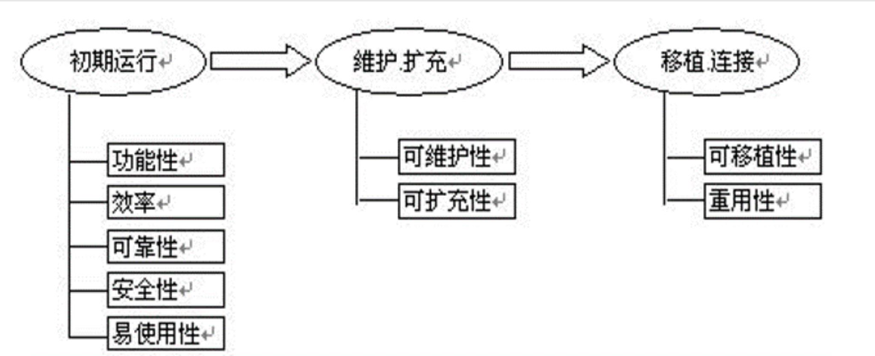
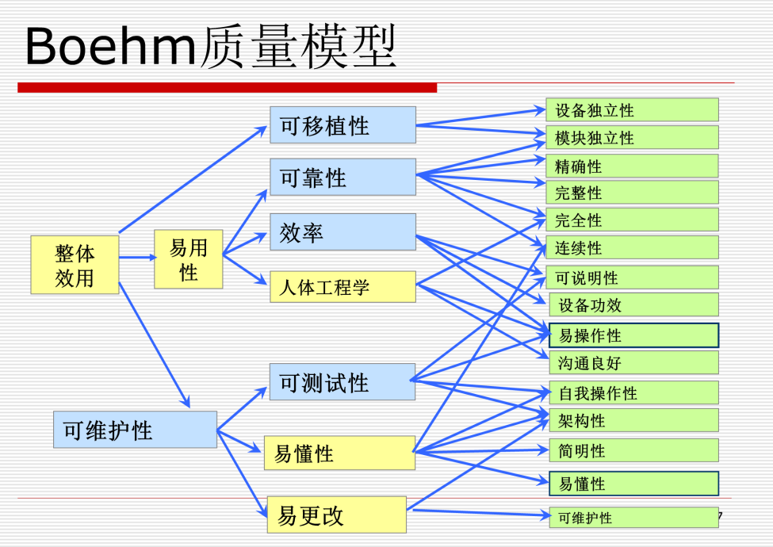
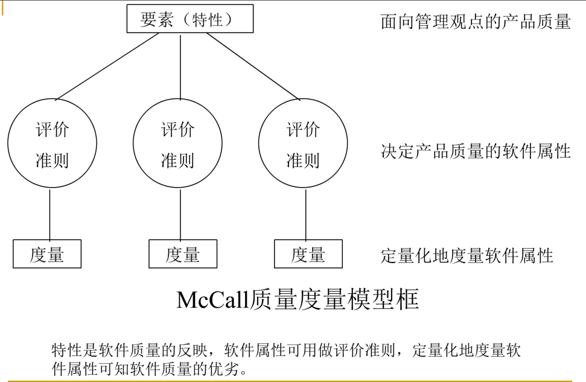
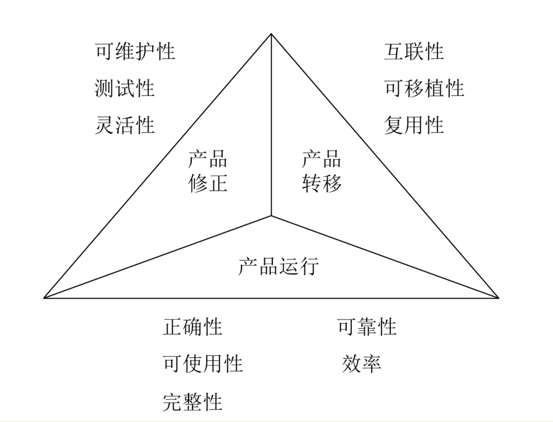
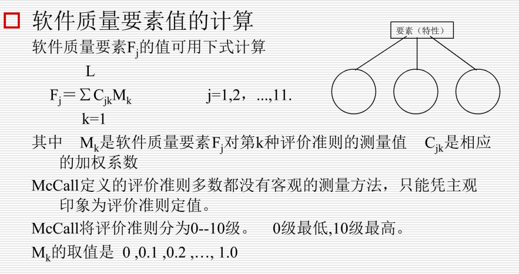
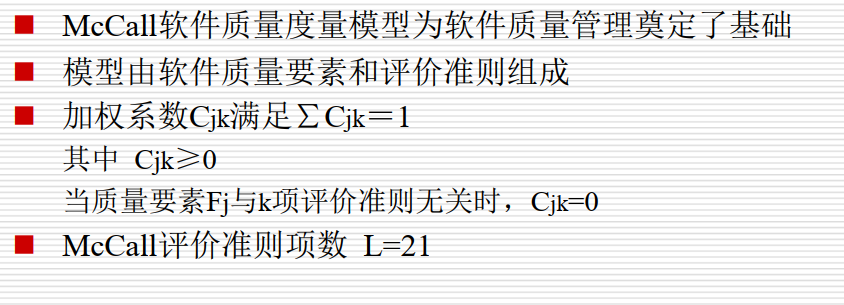
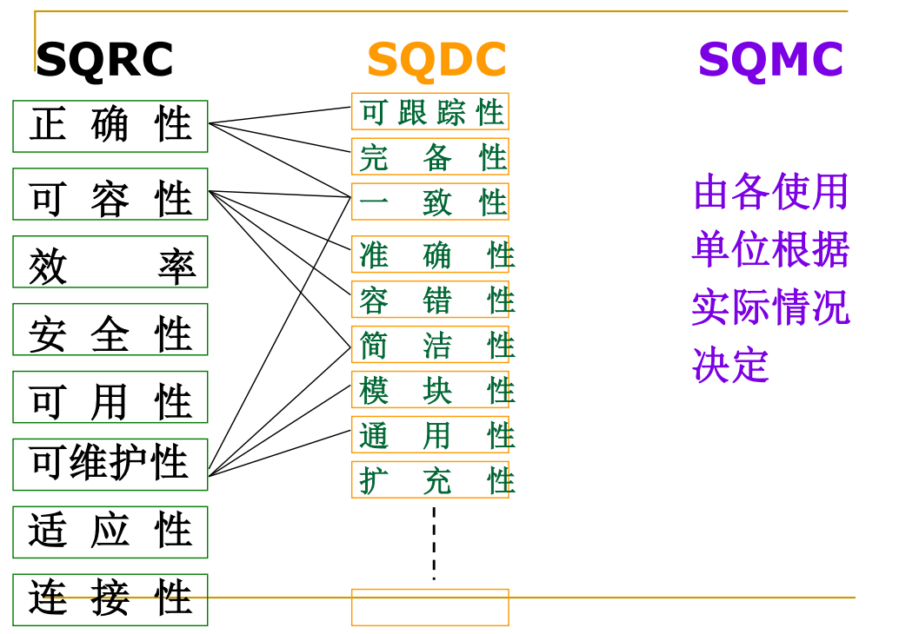
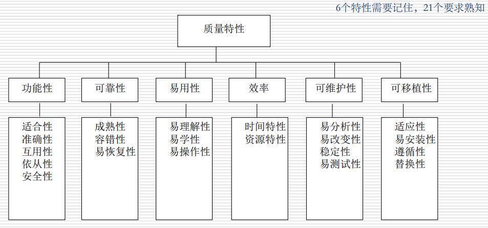
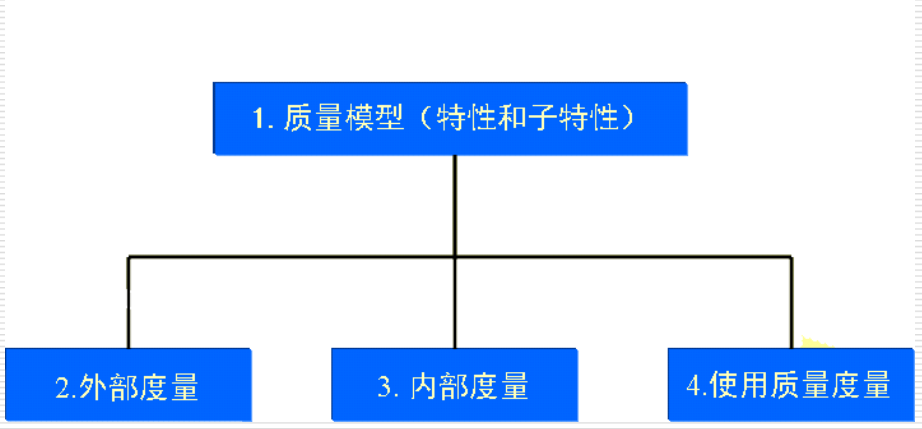
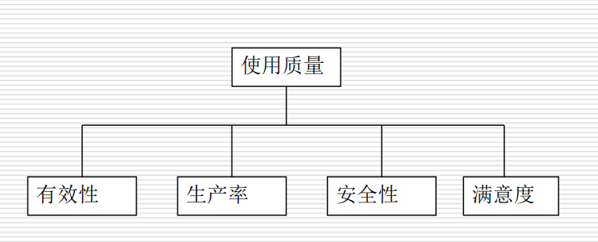

### 3 软件质量的定义

#### 3.1软件质量的定义

1. ANSI/IEEE Std 729-1983定义软件质量为：**“与软件产品满足规定的和隐含的需求的能力有关的特征或特性的全体”。**其含义有四：
   - 能满足给定需要的性质和特性的全体；
   - 具有所期望的各种属性的组合程度；
   - 顾客和用户觉得能满足其综合期望的程度；
   - 确定软件在使用中将满足顾客预期要求的程度。

2. M.J.Fisher将软件质量定义为：**“所有描述计算机软件优秀程度的特性的组合。”**

3. GB/T6583-ISO 8402（1994）定义软件质量为：**“反映实体满足明确和隐含需要的能力和特性总合”**

4. 软件质量还被定义如下：

   - 客户满意度
   - 一致性准则
   - 软件质量度量
   - 过程质量观

5. 软件质量和一般产品质量类似

   - 可说明性
   - 有效性
   - 易用性

6. RUP中，软件质量被定义为具有以下三个维度：

   - 功能

   - 可靠

   - 性能

     简而言之，软件质量是软件一些特性的组合，它依赖软件的本身

- 从用户最感兴趣的角度来说，软件质量可以从3个不同的角度来看待：**如何使用软件，使用效果如何，软件性能如何**
- 从开发团队来看
  - 生产出满足质量要求的软件
  - 中间件的质量
  - 如何运用最少的资源，最快的进度生产出质量最优的产品
- 从维护者角度来看：对软件维护方面的特性感兴趣
- 对企业管理者来说，注重总体利益和长远利益

- 软件质量反映了以下三个方面问题：
  - 软件需求时度量软件质量的基础
  - 规范化的标准定义了一组开发准则
  - 一般来说会有一些隐含的需求没有显式提出来

#### 3.2软件质量特性

- 与质量有关的特性是质量特性
- 软件质量特性，反映了软件的本质
- 定义一个软件的质量，就等价于为该软件定义一些列质量特性

通常，软件质量可由以下主要特性来定义：

- **功能性**
- **效率**
- **可靠性**
- **安全性**
- 易用性
- 可维护性
- 可扩充性
- 可移植性
- 重用性

#### 3.3 软件生存期与质量特性

从用户的角度看，软件的生存期可分为如下三个阶段：

- 初期运用：运行新开发的软件产品。
- 维护与扩充：在运行过程中修改缺欠的内容；而且，为了进一步的使用，需根据运行环境（主要指应用环境和技术环境）的变化做功能上和性能上的扩充。
- 移植和连接：把在原有平台上运行的软件向其它新的运行环境转移、或者组成软件包以便重用、或与其它软件进行连接。

### 4 影响软件质量的主要因素

 **总体上来说有三个：开发软件产品的组织，开发过程及开发使用的方法和技术**，具体如下

- 开发方法和工具
- 开发人员训练因素
- 软件开发的组织形式
- 文档的提供
- 复杂性
- 环境
- 现有的软件模型
- 需求转换和可跟踪性
- 测试方法
- 维护
- 计划和资源
- 语言
- 现有的类似软件
- 软件的质量特征
- 设计参数的折中

### 5.软件质量模型

什么是软件质量模型：

人们通常将影响软件质量的特性用软件质量模型来描述，所谓质量模型是指提供声明质量需求和评价质量基础的特性以及特性之间关系的集合，换句话说**质量模型是用来描述质量需求以及对质量进行评价的理论基础**

#### Boehm质量模型

#### 软件质量特性定义的分层模型

McCall软件质量模型的三层次

- 质量要素

- 准则

- 度量

  
  
  - 软件质量要素直接影响软件开发过程各个阶段的产品质量
  - 随着对软件质量理解的不断深化，质量要素不是一成不变的

#### McCall质量模型

- 软件质量特性之间的竞争
  - 在软件的质量特性与质量特性之间、质量特性与质量子特性之间存在着有利的影响和不利的影响
- 软件质量要素评价准则
  - McCall定义了一组较易度量的软件质量要素评价准则，对反映质量特性的软件属性评级，以此来估计软件质量特性的值。
- 软件质量要素属性
  定义评价准则的关键是确定影响软件质量要素的属性。这些属性必须满足：
  - 比较完整、准确的描述软件质量要素；
  - 比较容易量化和测量，能够反映软件质量的优劣。
- McCall的软件质量要素评价准则（不重要）
  - 可审查性
  - 准确性
  - 通信通用性
  - 完全性
  - 简明性
  - 一致性
  - 数据通用性
  - 容错性
  - 执行效率
  - 可扩展性
  - 通用性
  - 硬件独立性
  - 检测性
  - 模块化
  - 可操作性
  - 安全性
  - 自文档化：源代码提供有意义文档的程度
  - 简单些
  - 软件系统独立性
  - 可追踪性
  - 易培训性 

##### 计算软件质量要素

- 软件质量要素值的计算

  

##### 软件质量的度量和评价

- 软件质量的度量

  软件质量度量是指被用来确定软件系统或软件产品某属性值的一种测量方法或测量尺度。是经验关系系统到数值关系系统的一种映射。

- **软件质量特性度量有两类：预测型和验收型。（在ISO9126中，软件质量度量又分内部度量、外部度量和使用质量度量3种。）**

- 预测度量

  - p34

- 验收度量

  - p34

- 步骤

  1. 确定软件质量需求；过程：
     - 需求获取：首先要理解用户的需求，区分哪些是质量需求，把这些需求记录下来，获得用户的确认
     - 需求分析：拿到用户确认的需求后，把用户的质量需求与我们设定的质量特性联系起来，一直区分到子特性。建立了这种关联后，可以根据分类，分级确定度量
  2. 确定度量p38
  3. 分析度量结果
  4. 确认质量度量

- 软件质量评价p40

  - 评分
  - 分析结果

- McCall质量度量模型小结p41

  

#### ISO质量模型

- 1.高层称软件质量需求评价准则（SQRC）；

- 2.中层称软件质量设计评价准则（SQDC）；

- 3.低层称软件质量度量评价准则（SQMC）。

  分别对应McCall等人的要素、评价准则和度量。高层是从用户观点出发；中层是从开发者观点出发。ISO认为应对高层和中层建立国际标准，以便在国际范围内推广软件质量管理，而低层可由各单位自行制定。

##### 软件质量模型

ISO/IEC9126:1991六个特性（不重要，看新的25010八个特性）

- 功能性

- 可靠性

- 易用性

- 效率

- 易维护性

- 易移植性

  

21个子特性（略，但需要了解一下）

##### 质量特性使用

- 定义软件质量需求，评价软件产品定义
  - 软件产品质量需求
  - 评价软件规格说明在开发期间是否满足质量需求
  - 描述已实现的软件的特征和属性（如用户手册）
  - 对开发的软件在未交付使用前进行评价
- 软件质量观点
  - 用户观点：功能、可靠、效率、易用、可移植
  - 开发者观点：除用户观点外，必须体现可维护
  - 管理者观点：关注总体质量，权衡进度、成本、质量

##### 软件质量评价

- 评价目的

  - 确定产品是否通过验收，确定何时发布产品
  - 与其他类似产品相比较，对产品进行选择
  - 在使用该产品时评估其正面及负面的影响
  - 确定何时优化或替换该产品

- 评价步骤

  ISO/IEC 9126：1991推荐为3步：

  - 质量要求定义
  - 评价准备
  - 评价过程

##### 质量需求定义p57

##### 评价准备p58

略

##### 评价过程

- 测量
- 评级
- 评估

##### ISO 9126

- 使用质量用的质量模型

  基于用户观点的质量

  

  - 有效性：软件产品在指定使用环境下，使用户准确、完整地获得规定目标的能力；
  - 生产率：软件产品在指定使用环境下，使用户花费合适的与有效性相关的资源数量的能力；
  - 安全性：软件产品在指定使用环境下，获得可接受的损害人类、商务、软件、财产或环境风险级别的能力；
  - 满意度：软件产品在指定使用环境下，使用户满意的能力。

##### 国内外软件测试标准

- 21世纪初始以来，国际软件工程标准化组织，一直在对软件产品评价与质量度量领域的国际标准进行研究，主要对象有：
  - ISO/IEC12119-1994"信息技术软件包质量要求和测试”
  - ISO/IEC9126“软件工程产品质量”ISO/IEC 14598“软件工程产品评价”
  - ISO/IEC 14598“软件工程产品评价”

##### ISO/IEC 25000模型

记不动了

##### ISO/IEC 25010（25000不想记了）（这个表一定要记住）

软件产品质量的八个特性

| 特征       | 子特征                                                       |
| ---------- | :----------------------------------------------------------- |
| 功能适用性 | 完整性，适合性，正确性                                       |
| 可靠性     | 成熟性，可用性，容错性，可恢复性                             |
| 性能效率   | 时间特性，资源利用率，容量                                   |
| 易用性     | 易识别性，易学习，易操作，用户错误保护，用户界面美观，易掌握（可访问性） |
| 安全性     | 保密性，完整性，抗抵赖性，可追踪性，真实性                   |
| 兼容性     | 共存性，互操作性                                             |
| 可维护性   | 模块性，可重用性，可分析性，可更改性，可测试性               |
| 移植性     | 适应性，可安装性，可替换性                                   |

