[TOC]

#  白盒测试

## 白盒测试概念

- 也称结构测试或逻辑驱动测试，是一种测试用例设计方法，它从程序内部逻辑结构及有关信息来设计和选择测试用例，对程序的逻辑路径进行测试。
- **应用白盒法测试时，手头必须有程序的规格说明以及程序清单**
- 目的：
  - 保证一个模块中的所有独立路径至少被执行一次
  - 所所有的逻辑值均需要测真假两个分支
  - 在上下边界及可操作范围内运行所有循环
  - 检查内部数据结构以确保其有效性
- 优点：
  - 迫使测试人员去仔细思考软件的实现
  - 可以检测代码中的每条分支和路径
  - 解释隐藏在代码中的错误
  - 对代码的测试比较彻底
- 缺点：
  - 代价昂贵
  - 无法检测代码中遗漏的路径和数据敏感性错误
  - 不验证规格的正确性

## 测试覆盖标准

- 穷举测试不可行：一般程序中有循环，路径数目极大，不可能做到完全覆盖

- 即使每条路径都测过，仍然可能存在错误

  - 穷举路径测试无法检查出程序本身是否违反了设计规范，即程序是否是一个错误的程序
  - 穷举路径测试不可能查出程序因为遗漏路径而出错
  - 穷举路径测试发现不了一些与数据相关的错误

- 为了衡量测试的覆盖程度，需要建立一些标准

  - 测试覆盖率越高效果越好

- 测试覆盖率

  -   用于确定测试所执行到的覆盖项的百分比。 测试覆盖率包括功能点覆盖率和逻辑覆盖率：-
    - 功能点覆盖率大致用于表示软件已经实现的功能与软件需要实现的功能之间的比例关系。
    - 逻辑覆盖率指程序逻辑的覆盖率， 可分为语句覆盖、 判定覆盖、 条件覆盖、 判定/条件覆盖、 组合覆盖和路径覆盖。

- 覆盖标准从低到高分别是

  - ​    语句覆盖 SC（Statement Coverage）

    - 是一个较弱的测试标准， 它的含义是： 选择足够的测试用例，使得程序中每个语句至少都能被执行一次。它是最弱的逻辑覆盖， 效果有限， 必须与其它方法交互使用。

  - 判定覆盖（ 也称为分支覆盖） DC（Decision coverage）

    - 执行足够的测试用例， 使得程序中的每一个分支至少都通过一次。判定覆盖只比语句覆盖稍强， 但实际效果表明， 只是判定覆盖，还不能保证一定能查出在判断条件中存在的错误。 因此，还需要更强的逻辑覆盖准则去检验判断内部条件  

  -   条件覆盖 CC（Condition Coverage）

    - 执行足够的测试用例， 使程序中每个判断的每个条件的每个可能取值至少执行一次；条件覆盖深入到判定中的每个条件， 但可能不满足判定覆盖的要求。

  - 判定/条件覆盖 CDC（Condition/ Decision Coverage）

    - 执行足够的测试用例， 使得判定中每个条件取到各种可能的值，并使每个分支取到各种可能的结果。
  - 判定/条件覆盖有缺陷： 从表面看， 它测试了所有条件的取值，但其实往往是某些条件掩盖了另一些条件， 会遗漏某些条件取值错误的情况。  
  
-   条件组合覆盖 MCC （Multiple Condition Coverage）
  
    - 执行足够的例子， 使得每个判定中条件的各种可能组合都至少出现一次。这是一种相当强的覆盖准则， 可以有效地检查各种可能的条件
  - 取值的组合是否正确。 它不但可覆盖所有条件的可能取值的组合， 还可覆盖所有判断的可取分支， 但可能有的路径会遗漏掉。 测试还不完全。
  
- 路径覆盖
  
  - 设计足够多的测试用例， 要求覆盖程序中所有可能的路径  
  
      

## 白盒测试的主要方法

- 逻辑驱动测试

  设计足够多的测试用例，运行所测程序，满足某种测试覆盖率要求，基本有

  - 语句覆盖
  - 判定覆盖（也称分支覆盖）
  - 条件覆盖
  - 判定/条件覆盖
  - 条件组合覆盖

- 基本路径测试

  设计足够多的测试用例，运行所测程序，要覆盖程序中所有可能的路径。是最强覆盖准则，但在路径数目很大时，没法完全覆盖，必须要压缩

## 逻辑驱动测试

### 语句覆盖

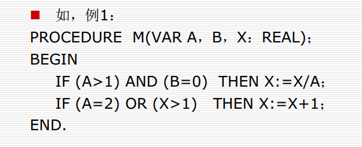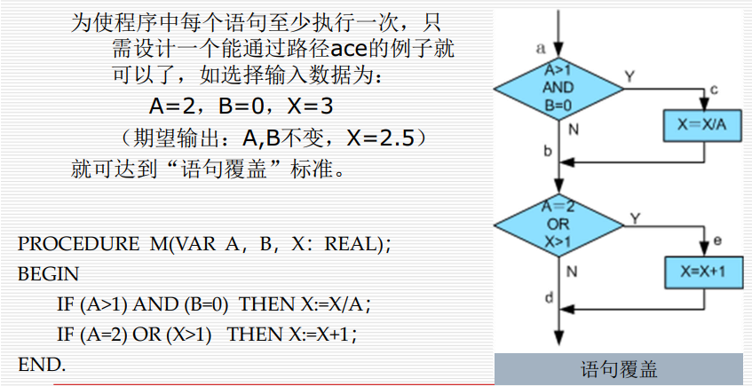

- 优点：可以很直观从源代码得到测试用例，无须细分每条判定表达式。

- 缺点：覆盖很弱，发现不了判定中逻辑运算的错误，不是一种充分的检验方法

  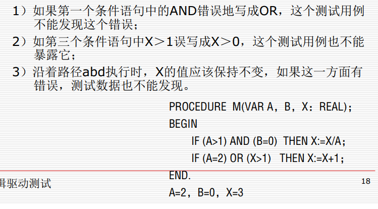

### 分支覆盖

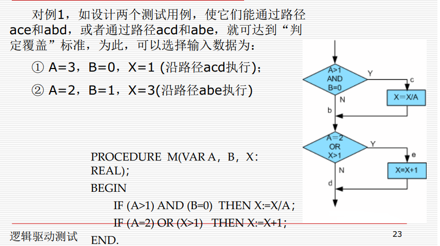

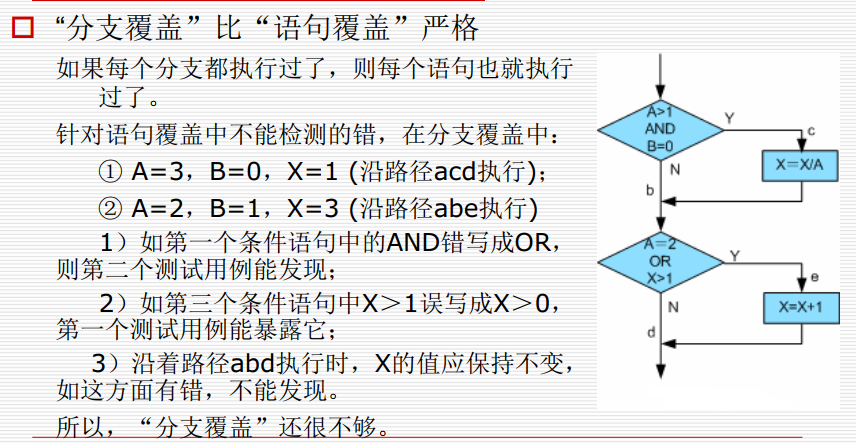

- 说明：判定覆盖更广泛的含义应该是使每一个判定获得每一种可能的结果至少一次

### 条件覆盖

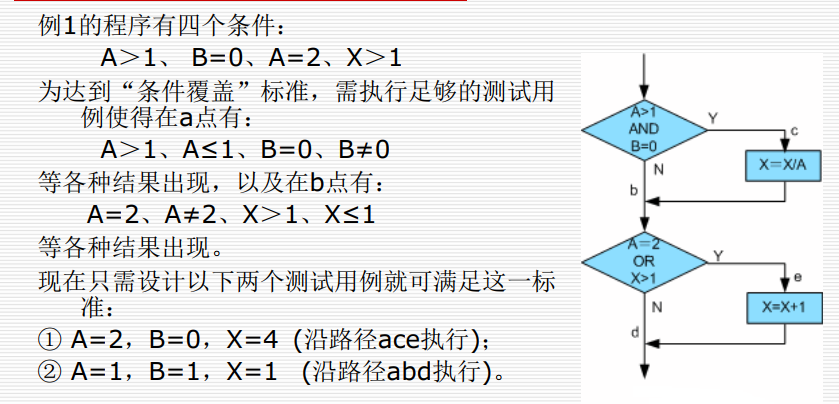

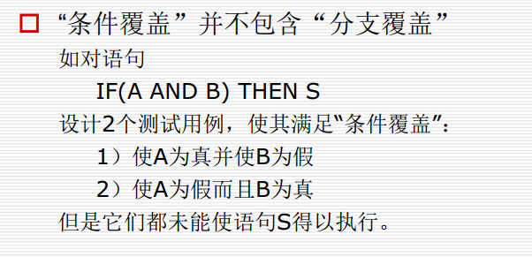

### 分支/条件覆盖

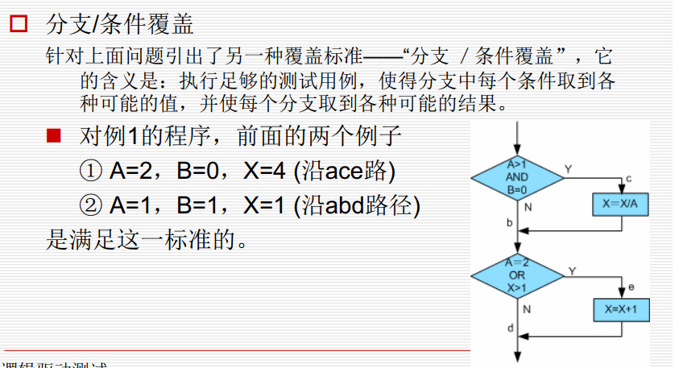

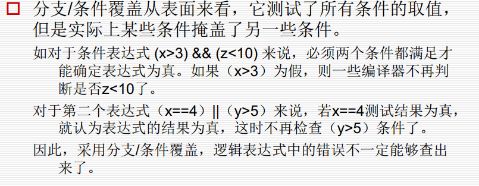

### 条件组合覆盖

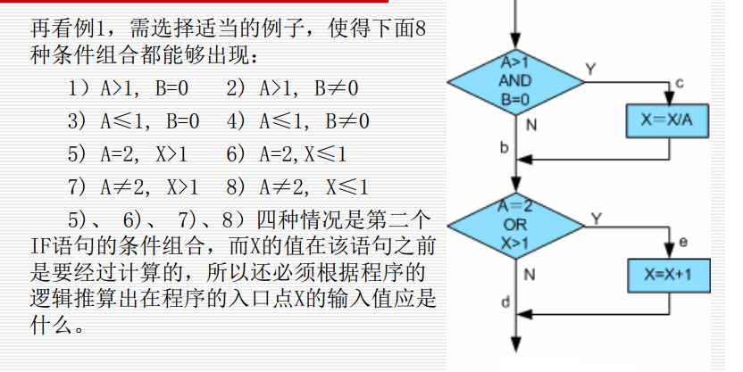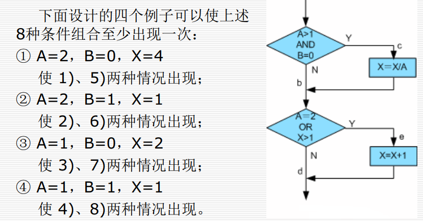

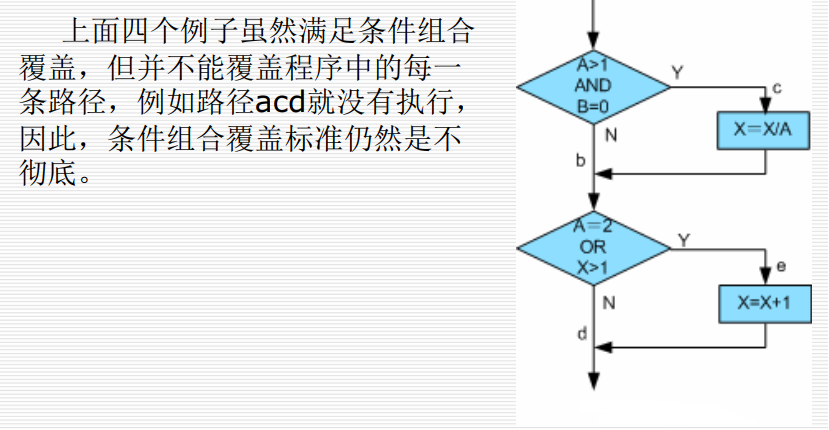

### 修正条件判定覆盖

在分支/条件覆盖的基础上，加上判定中的每一个条件必须能够独立影响一个判定的输出，即在其他条件不变的前提下仅改变这个条件的值，而使判定结果改变

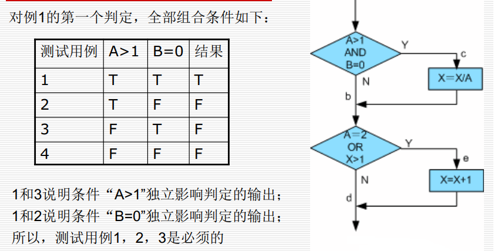

## 基本路径测试

## 控制结构测试的变种