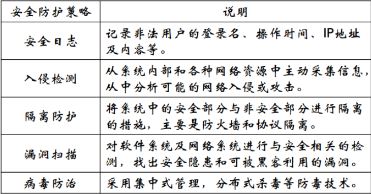

1. 采用决策表进行测试用例设计的主要步骤
   1. 确定规则个数
   2. 列出所有条件桩和动作桩
   3. 填入条件项和动作项
   4. 合并相似规则，简化决策表
2. 继承成员函数需要重新测试的情况
   1. 继承的成员函数在子类中做了改动
   2. 成员函数调用了改动过的成员函数
3. 几种文档
   1. 测试计划
   2. 测试说明
   3. 测试记录
   4. 测试报告
   5. 测试错误报告
4. 系统测试几种
   1. 自底向上
   2. 自顶向下
   3. 混合

5. 表单测试哪几项

   1. 每个字段的验证
   2. 字段的缺省值
   3. 表单的错误输入
   4. 提交操作的完整性

6. 安全策略

   