# 测试用例设计--黑盒测试

## 测试用例设计概述

- 什么是软件测试用例
  - 测试用例是为了特定的目的而设计的一组测试输入、执行条件和预期的结果
  - 测试用例是执行的最小实体
  
- 好的测试用例的特点
  - 完整性：最基本要求，还体现在临界测试，压力测试，性能测试等方面
  - 准确：不能出现模糊不清的语言
  - 清晰，简洁：较强针对性，最大操作步骤不超过15步
  - 可维护性：可修改，增加，删除
  - 适当性：适合测试环境和整个团队的测试水平
  - **可复用性：要求不同测试者在同样测试环境下使用同样的测试用例都能得到相同结论**
  - 其他：如可追溯性，可移植性等，另外，好的测试用例也是最有可能抓住错误的，不重复，多余的；是一组相似测试用例中最有效的。
  
- 为使测试有效，必须使用策略，发现尽可能多的缺陷

- 为使测试有效率，必须用最少的测试去发现最多的缺陷

- 测试就像侦探：
  - **理解设计人员和程序员的思路**
  - **不能遗忘任何不保险的东西**
  - **不能花费过多时间，必须要有效率**
  
- 测试用例--质量
  
  - 具有合理的捕获缺陷的概率
  - 执行了重要的区域
  - 做了应引起注意的事情
  - 不做多余的事
  - 既不太简单也不太复杂
  - 不与其他测试用例冗余
  - 使缺陷显而易见
  - 考虑缺陷的隔离和识别
  
- 测试用例编写标准

  在ANSI/IEEE829-1983标准中列出了和测试设计相关的测试用例编写规范和模板。标准模板中主要元素如下：

  - 标识符
  - 测试项--准确描述所需要测试的项及其特征
  - 测试环境要求
  - 输入标准--执行用例的输入要求（可能包括数据，文件或者操作）
  - 输出标准
  - 测试用例之间的关联--测试用例与其他测试或测试用例之间的依赖关系

- 测试用例的维护

  - 增加
    - 针对新被测特征的测试用例
  - 删除
    - 零碎的测试用例
    - 过时的测试用例
    - 不受控制的测试用例
    - 冗余的测试用例
  - 修改
    - 为适应被测对象的变更进行修改
  - 测试用例设计的误区
    - 没缺陷的就是好的用例
    - 应详细记录所有操作信息
    - 用例设计是一劳永逸的事情
    - 用例不应包含实际的数据
    - 用例中不需要明显的验证手段

## 黑盒测试

### 概念

- **黑盒测试又称为功能测试、数据驱动测试或基于规格说明书的测试，是一种从用户观点触发的测试**

  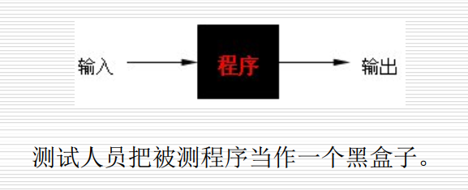

### 黑盒测试的特点

- **测试人员不用了解程序内部的代码和实现**
- 测试用例不依赖于系统内部的设计与实现
- 用例设计基于功定义和需求说明书
- 从用户角度进行测试
- 关注测试数据的选择和测试结果的分析
- 对测试人员的编程技术要求不高
- 在自动化测试时比较有效
- 不易发现代码部分的缺陷

### 黑盒目的

主要是在已知软件产品所应具有的功能的基础上，进行：

1. 检查程序功能是否按需求规格说明书的规定正常使用，测试各个功能是否有遗漏，检测性能等特性要求是否满足
2. 检测人机交互是否错误，检测数据库访问是否错误，程序是否能正确接收正确输出，是否能保持数据完整性
3. 检测程序初始化和终止方面的错误

### 错误类型

1. 不正确或遗漏的功能
2. 接口，界面错误
3. 性能错误
4. 数据结构或外部数据访问错误
5. 初始化或终止条件错误等等

### 考虑以下问题

1. 如何测试功能的有效性
2. 何种类型的输入会产生好的测试用例
3. 系统是否对特定的输入值尤其敏感
4. 如何分隔数据类的边界
5. 。。。

### 应用

运用黑盒测试方法，可以导出满足以下标准的测试用例集：

1. 所设计的测试用例能够减少达到合理测试所需的附加测试用例数；
2. 所设计的测试用例能够告知某些类型错误的存在或不存在，而不是仅仅与特定测试相关的错误。

黑盒测试又可分为功能测试和非功能测试功能测试主要有：

- **等价类划分、边界值分析、因果图法、**判定表法、场景法、正交实验法，随机测试法、错误推测法等。

非功能测试主要有：

- 配置/安装测试、兼容性测试、互操作性测试、文档和帮助测试、性能测试、可靠性测试、易用性测试和界面测试等。

### 穷举测试不可能

理论上可以，但实际几乎不可能

## 黑盒测试的数学知识

略

## 黑盒测试用例设计技术

### 等价类划分方法

#### 概述

- **将不能穷举的测试过程进行合理的分类，从而保证设计出来的测试用例具有完整性和代表性**
- 等价类划分法：  是把所有可能的输入数据，即程序的输入域划分为若干个等价类（子集），然后从每一个子集中选取少数具有代表性的数据作为测试用例。  
- **等价类：可以合理的假定：测试某等价类的代表值就是等效于对于这一类其他值的测试**

#### 原则

- **等价类特性**
  - **完备性：整个输入域提供一种形式的完备性**
  - **无冗余性：若互不相交则可保证一种形式的无冗余性**
- 如何划分
  - 划分等价类最重要的就是：集合的划分，划分为互不相交的一组子集，而子集的和并不是整个集合
  - 先从规格说明书中找出各个输入条件，再为每个输入条件划分多个等价类，形成若干各互不相交的子集。再在同一类中标识（选择）一个测试用例。（同一等价类中，往往处理相同，相同处理映射到”相同的执行路径“）
- **步骤**
  - **确定等价类，列出等价类表**
  - **确定测试用例**
- 两种等价类
  - 有效等价类
  - 无效等价类
- 划分方法
  - 按照区间划分：在输入条件规定了取值范围或值得个数得情况下，则可以确定一个有效等价类和两个无效等价类
  - 按照输入限制划分：在输入有明确限制条件时，如规定输入必须为数字，则可确定一个有效等价类和一个无效等价类
  - 按照输入布尔量划分：输入是一个
  - 按照数值划分
  - 按照限制条件或规则划分
  - 细分等价类：进一步划分

#### 用例设计

- 设计测试用例

  - 在确立了等价类后，**可建立等价类表**，列出所有划分的等价类

    

  - 在设计测试用例时**，应同时考虑有效等价类和无效等价类测试用例的设计**、

  - 然后从划分出的等价类中按照以下三个原则设计测试用例

    1. 为每个等价类规定一个唯一的编号
    2. 设计一个新的测试用例，使其尽可能多地覆盖尚未被覆盖的等价类，重复，直至所有有效等价类都被覆盖为止
    3. 设计一个新的测试用例，使其仅覆盖一个尚未被覆盖的无效等价类，重复，直至所有无效等价类都被覆盖为止

#### 常见测试形式

- 针对缺陷相关性假设，可将等价类测试分为
  - 弱等价类测试（单缺陷假设）
  - 强等价类测试（多缺陷假设）
    - 需要等价类笛卡尔积的每个元素对应的测试用例
- 针对是否对无效数据进行测试，可以将等价类测试分为：
  - 标准等价类测试：不考虑无效值，测试用例使用每个等价类中的一个值
  - 健壮等价类测试：主要的出发点使考虑了无效等价类，有效无效都取一个值

#### 实例

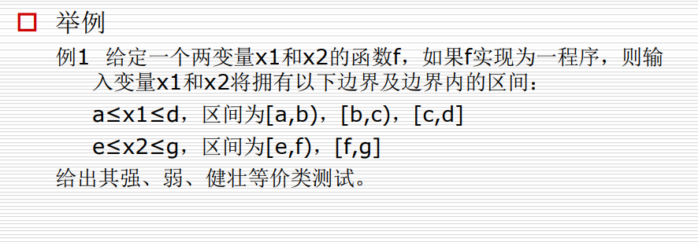

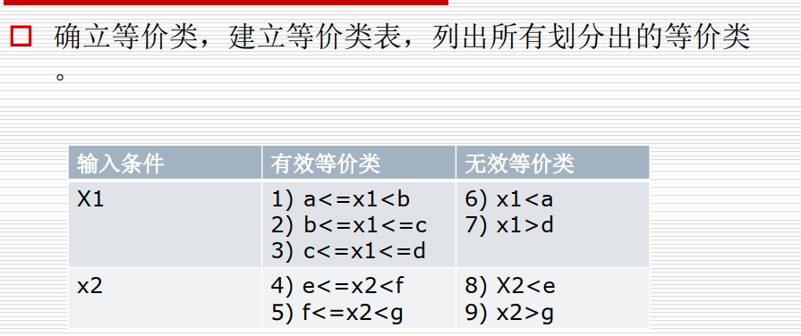

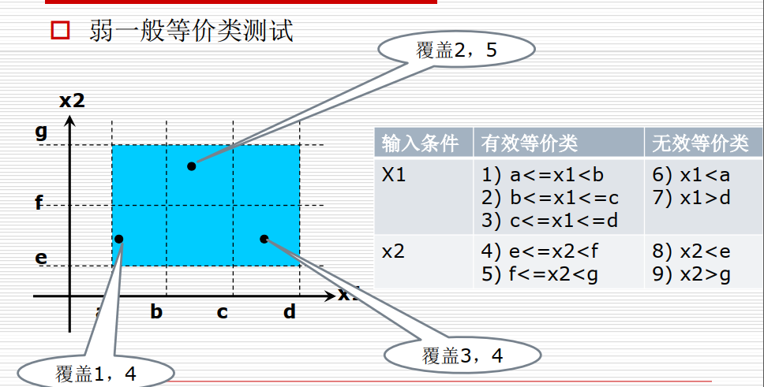

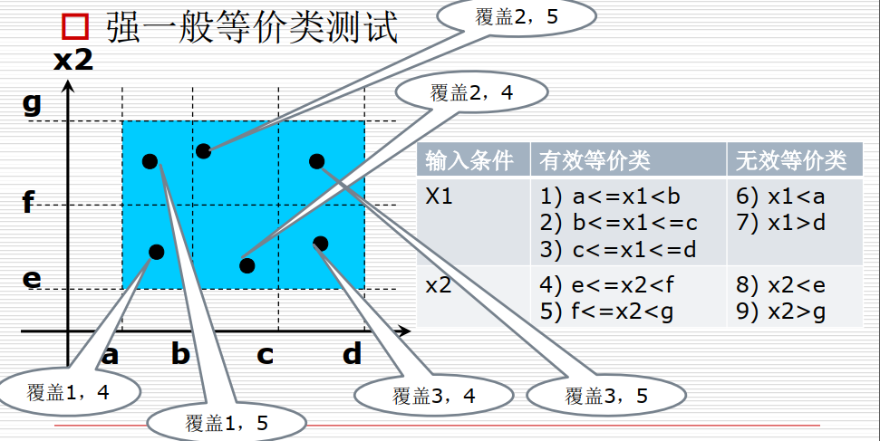

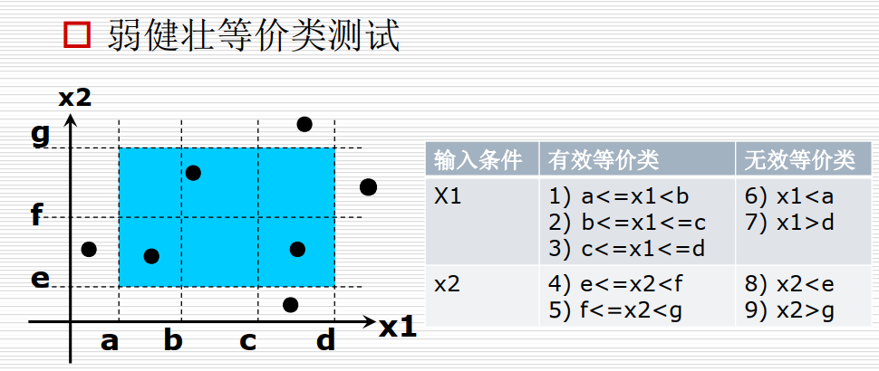

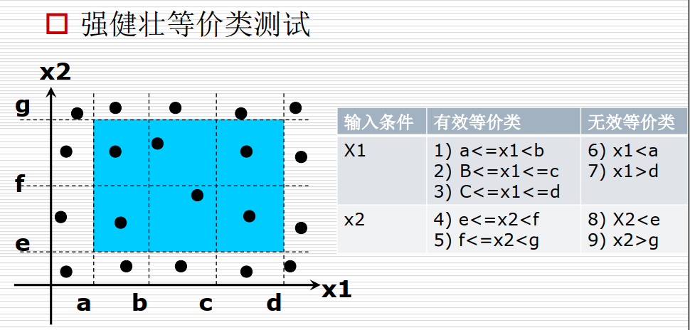

###  边界值分析法

#### 概述

- 边界值分析法就是对输入或输出的边界值进行测试的一种黑盒测试方法。通常边界值分析法是作为对等价类划分法的补充，这种情况下，其测试用例来自于东家类的边界
- 为什么用：无数的测试实践表明，大量的故障往往发生在输入定义域的边界上，一般可以取得较好的测试效果

#### 怎样用边界值分析法设计测试用例

- 首先确定边界情况。通常输入或输出等价类的边界就是应该着重测试的边界情况
- 选取正好等于，刚刚大于或刚刚小于边界的值作为测试数据，而不是选取等价类中的典型值或任意值

- 与等价类的区别
  - 和等价类使用一样的划分，只是假定错误更多的存在于边界上
  - 不是从等价类中挑一个代表，而是等价类的每个边界都要作为测试条件
  - 边界值分析不仅考虑输入条件，还要考虑输出空间产生的测试情况 

#### 原则

1. 如果输入条件规定了值的范围，则应取刚达到这个范围得边界值，以及刚刚超越这个范围边界得值作为测试输入数据
2. 如果输入条件规定了值的个数，则用最大个数，最小个数，比最小个数少一，比最大个数大多一的数作为测试数据
3. 将规则1和2应用于输出条件，即设计测试用例使输出值达到边界值及其左右的值
4. 如果程序的规格说明给出的输入域或输出域使有序集合（如有序表，顺序文件等），则应选取集合的第一个元素和最后一个元素作为测试用例
5. 如果程序中使用了一个内部数据结构，则应当选择这个内部数据结构的边界上的值作为测试用例
6. 分析规格说明，找出其他可能的边界条件

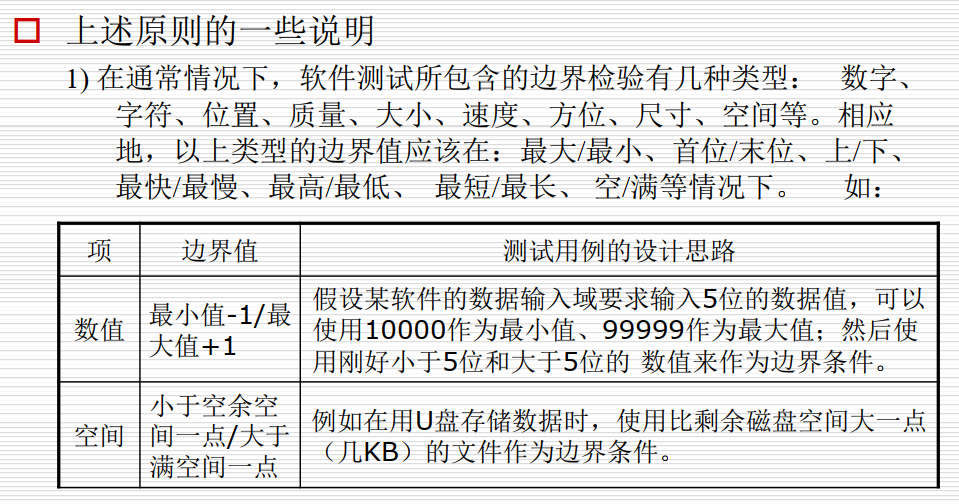

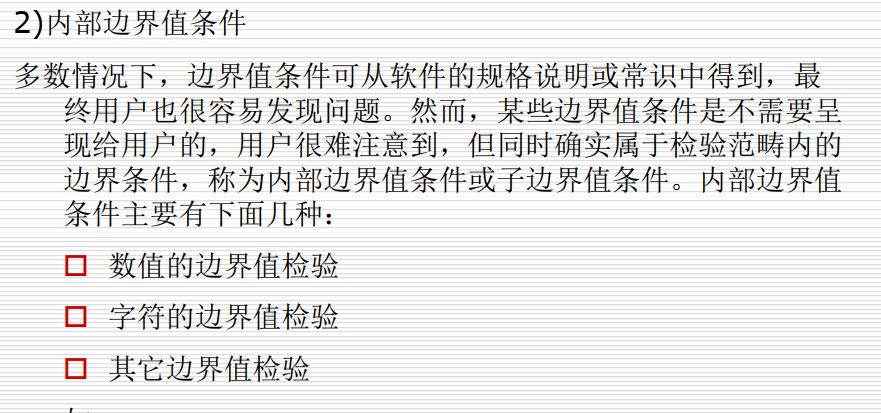

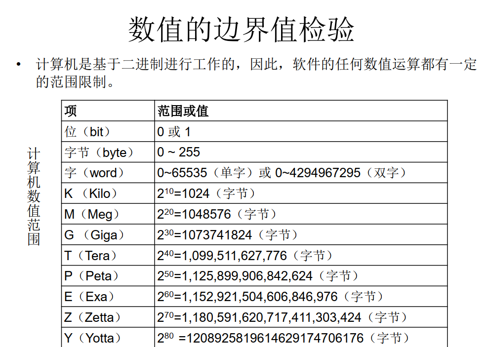

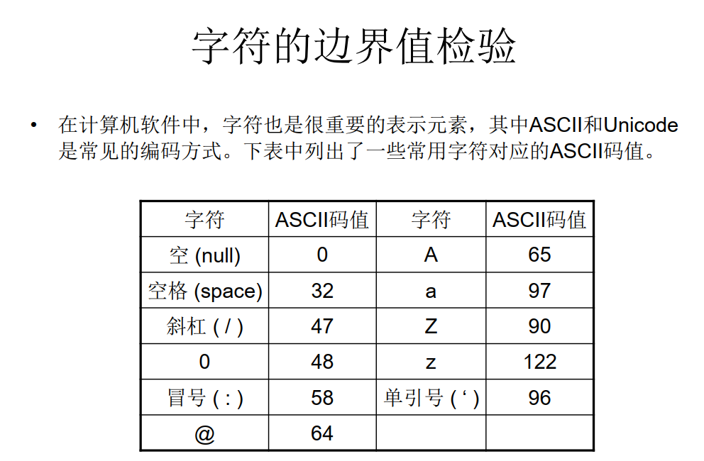

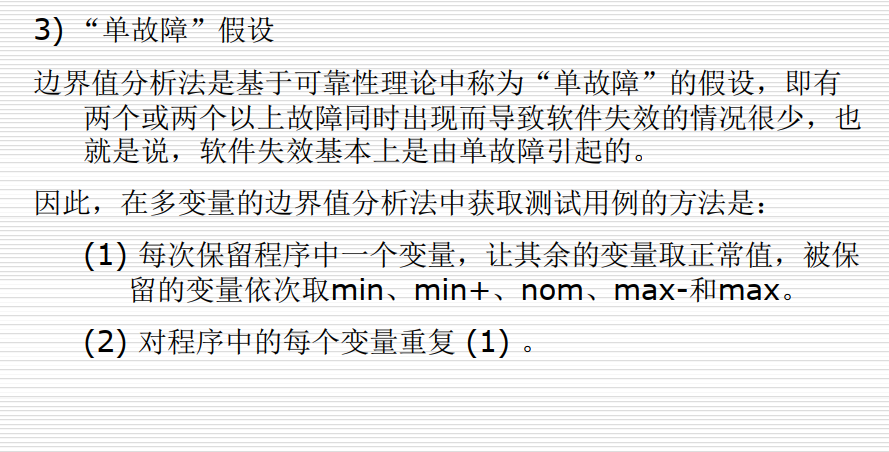

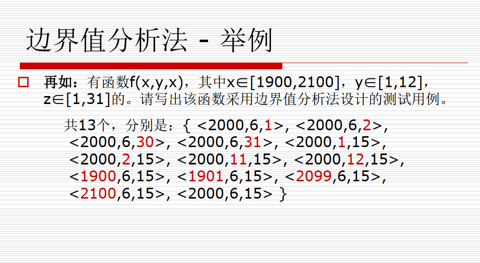

- **健壮性测试**
  - **健壮性测试是作为边界值分析的一个简单扩充它除了对变量的5个边界值分析取值外，还需要增加一个略大于最大值（MAX+）以及略小于最小值（MIN-）的取值，检查超过极限值时系统的情况。因此，对于有n个变量的函数采用健壮性测试需要6n+1个测试用例**

### 错误推测法

- 基于经验和直觉推测程序中所有可能存在的各种错误，从而有针对性地设计测试用例的方法

  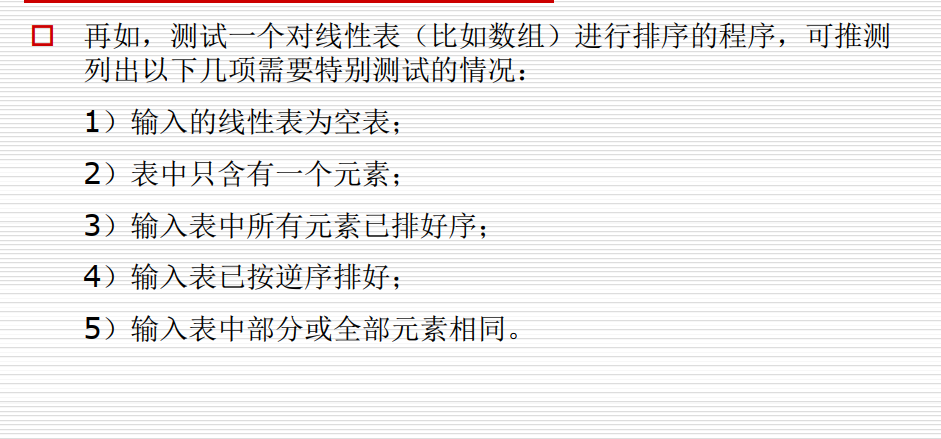