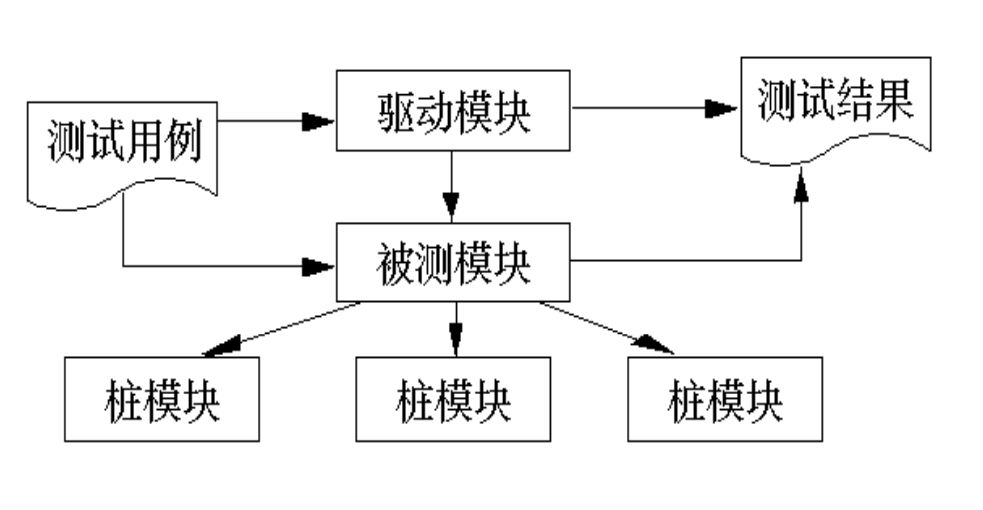
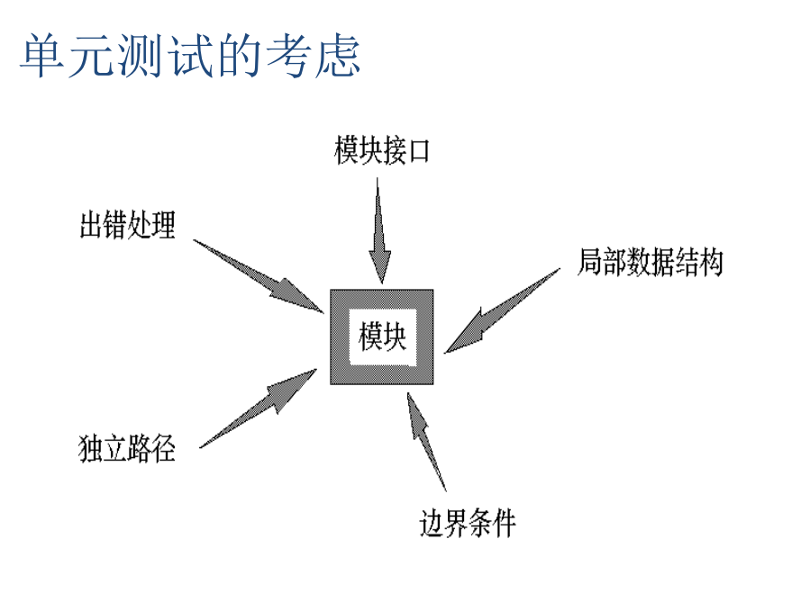
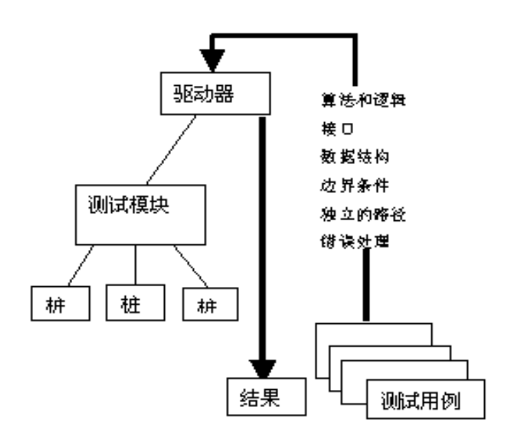
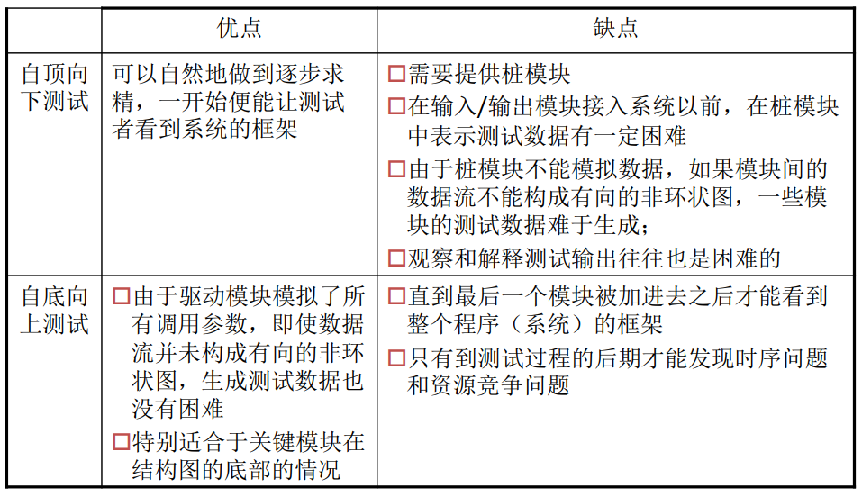
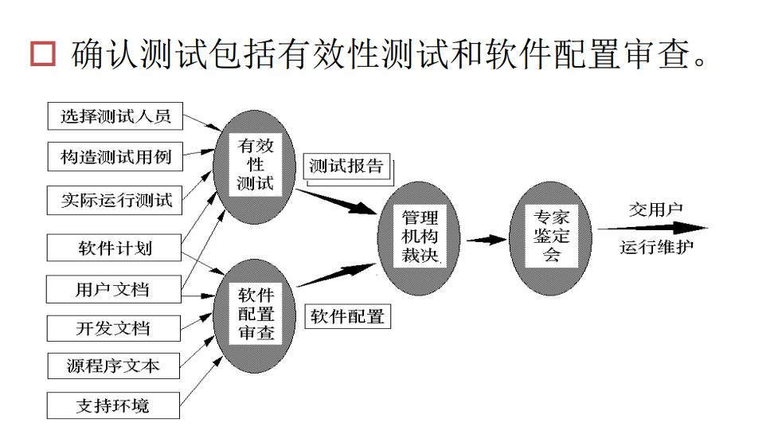

# 软件测试规范  GB/T 15532-2008

## 总则

- 目的
  -  验证是否满足文档要求
  - 通过测试，发现软件缺陷
  - 为QA的测量和评价提供依据
- 测试类别
  - 单元测试
  - 集成测试
  - 确认测试
  - 系统测试
  - 验收测试
  - 回归测试可出现在每个测试中，贯穿整个软件生命周期
- 测试过程
  - 测试策划：测试需求分析
  - 测试设计：分析并选用或设计测试用例
  - 测试执行：执行用例
  - 测试总结：整理和分析测试数据
- ISTQB
  - 计划与控制
  - 分析与设计
  - 实施与执行
  - 评估出口准则和报告
  - 测试结束活动
- 测试方法
  - 静态
  - 动态
- 测试用例
  - 设计原则
    - 基于测试需求
    - 基于测试方法
    - 兼顾测试充分性和效率
    - 测试执行的可再现性
  - 测试用例要素
    - 名称和标识
    - 测试追踪
    - 用例说明
    - 测试的初始化要求
    - 测试的输入
    - 期望的测试结果
    - 评价测试结果的准则
    - 操作过程
    - 前提和约束
    - 测试终止条件
- 测试管理
  - 测试准入条件
    - 具有测试合同或项目计划
    - 具有测试所需的各种文档
    - 所提交的被测软件受控
    - 软件源代码正确通过编译或汇编
  - 准出条件
    - 完成合同要求的测试任务
    - 遵循了计划
    - 客观，详细记录了测试过程中所发现的所有问题
    - 测试文档齐全
    - 测试过程在控制下进行
    - 所有问题都得到合理解决
    - 测试工作通过了测试评审
    - 所有制品纳入配置管理

-  测试策略
  1. 从模块层开始，然后扩大延伸到基于计算机的系统集合中
  2. 不同的测试技术适用于不同的时间点
  3. 测试时由软件的开发人员和独立的测试组来管理的
  4. 测试和调试是不同的活动，但是调试必须能够适应任何的测试策略
- 测试充分性准则
  - 对任何软件都存在有限的充分测试集合
  - 单调性
  - 非复合性
  - 非分解性
  - 复杂性
  - 回报递减率

## 单元测试

- 概述：
  - 是针对软件设计的最小单位（程序模块）进行正确性检验的测试工作
  - 目的：检查每个软件单元能否正确实现说明中的功能，约束，接口等要求
- 测试对象
  - 为可独立编译或汇编的程序模块（或类）
  - 只测单元内活动，不测单元间接口

- 技术要求
  - 按文档规定测试软件单元的功能，性能，接口等项
  - 每个软件特性至少被一个正常和异常的测试用例覆盖
  - 测试用例输入应至少包括有效等价类值，无效等价类值和边界数据值
  - 在动态测试前，先进行静态测试（源代码）
  - 语句覆盖应达到100%
  - 分支覆盖应达到100%
  - 对输出数据及其格式进行测试
- 测试策略
  
- 单元测试需要从程序的内部结构出发设计测试用例，多采用白盒测试技术为主，黑盒为辅。多个模块可以平行地独立进行单元测试。
  
-  总则

  - 静态测试：当静态测试时，所测试的内容与选择的测试方法有关。如，采用代码审查方法，通常要对寄存器的使用（仅限定在机器指令和汇编语言时考虑）、程序格式、人口和出口的连接、程序语言的使用、存储器的使用等内容进行检查；采用静态分析方法，通常要对软件单元的控制流、数据流、接口、表达式等内容进行分析。
  - 动态测试：**当动态测试时，通常对软件单元的功能、性能、接口、局部数据结构、独立路径、出错处理、 边界条件和内存使用情况进行测试。**对具体的软件单元，应根据软件测试合同（或项目计划）、软件设计文档的要求及选择的测试方法确定测试的具体内容  

- 驱动模块和桩模块

  - 模块并不是一个独立的程序，在考虑测试模块时，调试要考虑它和外界的联系，应为测试模块开发一个驱动模块和若干桩模块
  - **驱动模块：用于模拟被测模块的上级模块**
  - **桩模块：也称存根模块，用于模拟被测模块的调用模块**
  - **两者都是测试使用的软件，而非软件产品的组成部分**，所以两者的开发应简单
  - 提高模块的内聚性可简单化单元测试

  

  

  

- 模块接口测试

  - 应首先对通过被测模块的数据流进行测试，只有在数据能正确流入流出模块的前提下，其他测试才有意义
  - 如果模块内包括外部输入输出，还应考虑下列因素
    - 文件属性是否正确
    - 正文书写/输入错误等

- 检查局部数据结构是为了保证临时存储在模块内的数据在程序执行过程中完整，正确

- 路径测试

  - 在模块中应尽可能地对每一条独立执行路径进行测试，满足某覆盖标准（独立路劲是在程序中至少引进一个新的处理语句或一条新的条件路径）
  - 由于不能穷举，所以基本路径测试和循环测试是最有效的测试技术，常见错误包括：
    - 死代码
    - 误解或用错了算符优先级
    - 混合类型运算
    - 变量初值错
    - 精度不够
    - 表达式符号错
  - 比较判断与控制流常常紧密相关，测试用例还应注意发现下列错误
    - 不同数据类型之间的比较
    - 错误使用逻辑运算符或优先级
    -  因计算机表示的局限性，期望理论上相等而实际上不相等的两个量相等
    - 关系表达式中比较运算或变量出错
    - 循环终止条件或不可能出现
    - 迭代发散时不能退出
    - 错误修改了循环变量

- 错误处理测试

  - 一个好的设计应能遇见各种出错条件，并预设各种出错处理

- 边界测试

  - 是单元测试中最后也是最重要的部分
  - 软件经常在边界失效，应使用边界值测试
  - 如果对性能有要求的话，还需要进行专门的关键路径测试

- 功能：应对软件设计文档规定的软件单元的功能逐项进行测试

- 性能：按软甲你设计文档的要求，对软件单元的性能（如精度，时间，度量等）进行测试

- 内存使用：检查内存使用情况，特别是动态申请的内存在使用上的错误（指针越界，内存泄漏等 ）

  ### 单元测试的文档

  - 文档一般有：
    - 单元测试计划
    - 单元测试内容
    - 单元测试报告
    - 单元测试记录
    - 单元测试问题报告

## 集成测试

- 概述
  - 集成测试：是将模块按照设计要求组装起来进行测试，主要目标是发现与接口有关的问题
  - 部件测试：子系统的组装测试特别称为部件测试，它所做的工作是要找出组装后的子系统与系统需求规格说明的不一致
- 测试对象
  - 任意一个软件单元集成到软件计算机软件系统的组装过程
  - 任意一个组装得到的软件系统
- 为什么要测
  - 一个模块可能会对另一个模块产生不利的影响
  - 子功能合成不一定能产生想要的功能
  - 独立测试无误差但组装测试后误差会超过可接受限度
  - 可能会发现单元测试中未发现的接口方面的错误
  - 在单元测试中无法发现时序问题
  - 在单元测试中无法发现资源竞争问题
- 目的：主要是发现接口错误，其他的根据上面写
- 技术要求
  - 应采用增量法，测试新组装的软件
  - 应逐项测试文档规定的功能，性能等
  - 应测试所有接口
  - 100%覆盖调用
  - 测试输出数据及格式
  - 测试运行条件
  - 根据文档要求，对软件功能，性能进行强度测试
  - 明确每一个危险状态和导致危险的可能原因，针对性测试
- 集成策略
  - 一次性组装（大爆炸）：也叫整体拼装，各单元测完后，组装成一个整体一起测，应该要避免这种组装方式
  - 增殖式组装：边连接边组装，把可能的差错分散暴露出来，便于找出问题和修改
- 集成步骤
  - 主控模块作为测试驱动，所有与主控模块直接相连的模块用桩模块替换，并对主模块进行测试
  - 根据集成的方式，每次用一个实际模块替换相应的桩模块
  - 在每个模块被集成时，都必须已经进行了单元测试
  - 进行回归测试以确定集成新模块后没有引入错误
- 自顶向下增式测试
  - 较早验证了主要控制和判断点
  - 功能可行性较早验证
  - 减少驱动模块开发费用
  - 支持故障分离
  - 桩模块开发和维护占据较大成本
- 自底向上增式测试
  - 从底层模块开始，完成指定的子功能，组装测试
  - 桩开发成本减少
  - 支持故障分离
  - 允许对底层模块进行早期验证
  - 驱动模块开发量大
  - 高层验证在最后，不易发现设计，整体架构上错误

- 混合增值式测试
  - 两个结合，常见的有
    -  衍变的自顶向下的增殖测试
    - 自底向上，自顶向下的增殖测试
    - 回归集成测试  
- 关键模块问题
  - **在组装测试时，应当确定关键模块，对这些关键模块及早进行测试**
  - 关键模块特征：
    - 满足某些软件需求
    - 在程序的模块结构中位于较高层次
    - 较复杂，较易发生错误
    - 有明确定义的性能要求
  - 在做回归测试时，也应该集中测试关键模块的功能
- 集成测试内容
  - 全局数据结构
  - 适合性方面
  - 准确性方面
  - 互操作性
  - 容错性方面
  - 时间特性方面
  - 资源利用性方面
- 集成测试完成的标志
  - 成功执行了测试计划中规定的所有集成测试
  - 修正了所发现的错误
  - 测试结构通过了评审
- 文档
  - 集成测试计划
  - 集成测试说明
  - 集成测试报告
  - 集成测试记录和测试日志
  - 集成测试问题报告

## 确认测试（配置项测试）

- 概述
  - 是验证软件的功能和性能及其他姓是否与用户的要求一致
  - 测试对象：软件配置项
  - 目的：检验配置项与软件需求规格说明的一致性  
  - 
- 测试内容
  -   GB/T15532-2008中，确认测试内容主要依据GB/T 16260.1规定的质量特性来进行，有别于传统的测试内容，测试内容主要从：功能性（适合性、准确性、互操作性、安全保密性）、可靠性（成熟性、容错性、易恢复性）、易用性（易理解性、易学性、易操作性、吸引性）、效率（时间特性、资源利用性）、维护性（易分析性、易改变性、稳定性、易测试性）、可移植性（适应性、易安装性、共存性、易替换性）和依从性等方面（可剪裁）来考虑。标准给出了各特性的测试内容。对具体的软件配置项，可根据软件合同（或项目计划）及软件需求规格说明的要求对标准给出的内容进行裁剪。  
  - 整理以下，大体可以分为界面，数据，操作，逻辑，接口等几个方面
- 使用技术
  - 是在模拟环境下（也就是开发的环境下），运用黑盒测试技术：
    - 等价类划分法
    - 边界值分析法
    - 错误推测法
    - 因果图法
    - 组合分析法
- 测试结果
  - 与预期符合
  - 与预期不符
- 软件配置复查
  - 目的是保证：
    - 软件配置的所有成份都齐全
    - 各方面的质量都符合要求
    - 具有维护阶段所必须的细节
    - 已经编排好分类的目录
    - 复查的主要内容是文件资料
- 文档
  - 配置项测试计划
  - 配置项测试说明
  - 配置项测试报告
  - 配置项测试记录和测试日志
  - 配置项测试文件报告

## 系统测试

- 概述
  - 是将通过确认测试的软件，作为整个基于计算机系统的一个元素，与计算机硬件，外设，某些支持软件，数据和人员等其他系统元素结合在一起，在实际运行环境下，对计算机系统进行一系列的测试
  - 测试对象：完整的集成的计算机系统，重点是新开发的软件配置项的集合
  - 目的：在于通过于系统需求定义做比较，发现软件与系统的定义不符合或与之矛盾的地方。系统测试的测试用例应根据需求分析规格说明来设计，并在实际使用环境下来运行
  - 意义
    - 软件在系统中占重要位置，软件测试好坏与能否顺利系统测试关系极大
    - 尽管每个检验都有特定的目标，然而所有的检测工作都要验证系统中每个部分均已得到正确的集成，并能完成指定的功能
- 技术要求
  -  系统的每个特性应至少被一个正常测试用例和一个被认可的异常测试用例所覆盖：
  -  测试用例的输入应至少包括有效等价类值、无效等价类值和边界数据值
  -  应逐项测试系统／子系统设计说明规定的系统的功能、性能等特性：
  - 应测试软件配置项之间及软件配置项与硬件之间的接口；
  - 应测试系统的输出及其格式；
  -  应测试运行条件在边界状态和异常状态下，或在人为设定的状态下，系统的功能和性能；
  -  应测试系统访问和数据安全性  
  -  。。。
-   系统测试的内容
  -  GB/T15532-2008中， 系统测试内容主要依据GB/T 16260.1规定的质量特性来进行，有别于传统的测试内容，测试内容主要从：功能性、可靠性、易用性、效率、维护性、可移植性和依从性等方面（可剪裁）来考虑。  
- 效率方面的术语
  -  响应时间：指系统为完成一项规定任务所需的时间
  -  平均响应时间
  -  响应极限时间
  -  吞吐量：指在给定的时间周期内系统能成功完成的任务数量
  -  平均吞吐量
  -  极限吞吐量
  -  周转时间
  -  平均周转时间
  -  周转时间极限：指在最大负载条件下，系统完成一项任务所需要时间的极限
-   系统测试的内容
  -  GB/T15532-2008中， 系统测试内容主要依据GB/T 16260.1规定的质量特性来进行，有别于传统的测试内容，测试内容主要从：功能性、可靠性、易用性、效率、维护性、可移植性和依从性等方面（可剪裁）来考虑。  
- 文档
  -  系统测试计划
  -  系统测试说明
  -  系统测试报告
  -  系统测试记录和测试日志
  -  系统测试问题报告

## 验收测试

- 概述
  - 检验是否按合同要求进行工作
- 测试对象：完整的集成的计算机系统
- 测试目的：验收测试目的是在真实的用户（或称系统）工作环境下检验完整的软件系统。是否满足软件开发技术合同规定的要求
- **验收测试和系统测试的区别**
  - **组织结构**
  - **测试低点**
  - **覆盖范围**
  - **实施人员**

- 验收测试的时机
  - **在通过系统测试后**
  - **商业现货软件产品可在安装或集成时进行**
  - **组件的可用性验收测试可在组件测试时进行**

- **范围**
  - **如果是用户定制软件，需要全面验收测试**
  - **如果是标准产品，已经在类似环境跑了很久了，典型用例测主要功能，性能**
  - **如果是系统集成，重点测互操作性**
- 文档
  - 验收测试计划
  - 验收测试说明
  - 验收测试报告
  - 验收测试记录
  - 验收测试问题报告

## 回归测试

- 概述
  - **在集成测试策略的环境中，回归就是对某些已经进行过测试的子集在重测一遍，以保证上述改变不会传播无法预料的副作用或引发新的问题**
  - **在更广的环境里，回归测试就是用来保证（由于测试或其他原因）改动不会带来不可预料的行为或另外的错误**
- **测试对象**
  - **未过单元测试，修改后，进行单元测试**
  - **未过确认测试，修改后，先单元，再集成和配置项（确认）测试**
  - **未过系统测试，修改后，先单元，再集成，配置项，和系统测试**
  - **其他原因修改的软件单元，也首先应对变更的单元进行测试，再进行其他相关测试**
- 目的
  - 测试软件变更后，**修改部分的正确性和对变更需求的符合性**
  - 测试软件变更后**，软件原存的，正确的功能，性能和其他规定的要求的不损害性**
- 单元回归测试
  -   应符合原软件单元测试的技术要求，可根据变更情况酌情裁剪。当回归测试结果和原软件单元测试的正确结果不一致时，应对软件单元重新进行回归测试  
  - 测试内容：
    - 仅重复修改前单元测试做的内容
    - 修改之前单元测试的内容
    - 在前两者基础上加上新内容
  - 测试内容
    - 原方法
    - 其他合适方法
  - 准入条件
    - 完成更改且处于配置管理下
    - 变更报告齐全
    - 有测试所有文档和资源
    - 具有相关测试的设施环境
  - 准出条件
    - 准出条件用来评价单元回归测试工作是否达到要求
    - 与原单元测试的准出条件一致
    - 软件单元回归测试的文档齐全，符合规范
- 其他一样推吧，不整了不整了

