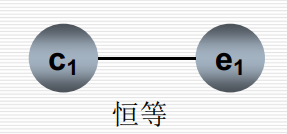
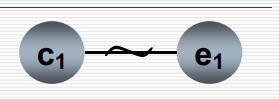
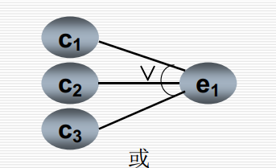
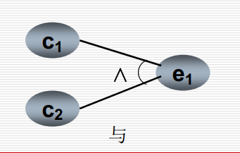
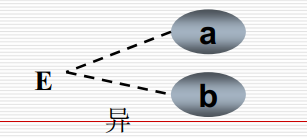
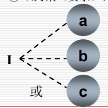
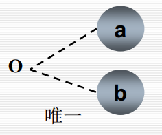
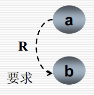
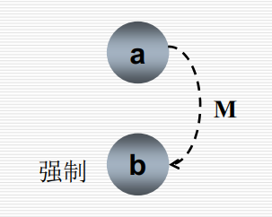

# 因果图法

## 因果图简介

- 采用因果图方法能够帮助我们按一定步骤，高效率地选择测试用例，同时还能为我们指出，程序规格说明描述中存在着什么样的问题
- 基于这样一种思想：一些程序的功能可以用判定表（或称决策表）的形式来表示，并根据输入条件的组合情况规定相应的操作
- 定义：是一种利用图解法分析输入的各种组合情况，从而设计测试用例的方法，适合检查程序输入条件的各种组合情况。
- **步骤**
  1. **根据程序规格说明书描述，分析并确定因（输入条件）和果（输出结果或程序状态的改变），画出因果图**
  2. **将得到的因果图转换为判定表**
  3. **为判定表中每一列表示的情况设计一个测试用例**
- 优点
  - 考虑到输入的各种组合和其之间的制约关系
  - 能够帮助测试人员按照一定的步骤，高效率的开发测试用例
  - 因果图法是将自然语言规格说明转换成形式语言规格说明的一种严格的方法，可以指出规格说明存在的不完整性和二义性

## 因果图介绍

- 四种符号分别表示了规格说明中的四种因果关系

  - 因果图中使用了简单的逻辑符号，以直线连接左右结点。左结点表示输入状态（或称原因），右结点表述输出状态（或称结果）
  - Ci表示原因，通常置于图的左边：ei表示结果，通常在图的右边，ci和ei均可取值0或1，0表示某状态不出现，1表示某状态出现

- 四种关系

  1. 恒等：若ci是1，则ei也是1，否则e1为0

     

  2. 非：若ci是1，则ei是0，否则ei是1

     

  3. 或：若c1或c2或c3是1，则ei是1；否则ei为0。“或”可有任意个输入

     

  4. 与：若c1和c2都是1，则ei为1；否则ei为0。“与”也有任意个输入

     

- 输入条件的四种约束

  1. E约束（异）：a和b中至多有一个可能为1，即a和b不能同时为1

     

  2. I约束（或）：a，b和c中至少有一个必须是1，即a，b和c不能同时为

     

  3. O约束（唯一）：a和b必须有一个，且仅有1个为1

     

  4. R约束（要求）：a是1时，b必须时1，即不可能a为1时b为0；

     

- 输出条件约束

  - M约束（强制）：若结果a是1，则结果b强制为0

    

- 因果图方法最终生成的是判定表。它适合于检查程序输入条件的各种组合情况。利用因果图生成测试用例的基本步骤

  1. 分析软件规格说明描述中，哪些是原因（即输入条件或输入条件的等价类），哪些是结果（即输出条件），并给每个原因和结果赋予一个标识符
  2. 分析软件规格说明描述中的内容，找出原因与结果之间，原因与原因之间对应的关系，根据这些关系，画出因果图
  3. 由于语法或环境限制，有些原因与原因之间，原因与结果之间的组合情况不可能出现，为表明这些特殊情况，在因果图上用一些约束表民约束或限制条件。
  4. 把因果图转换为判定表
  5. 把判定表的每一列拿出来作为依据，设计测试用例

## 因果图测试举例

